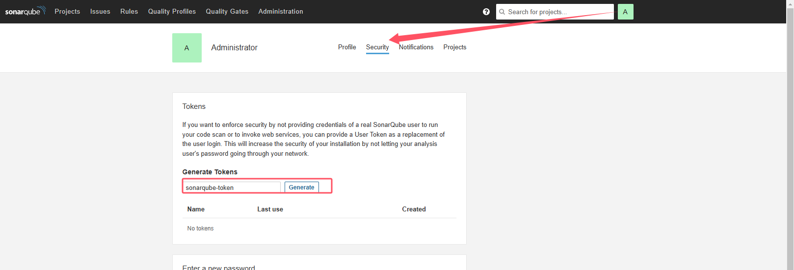

# Jenkins和SonarQube集成实现代码审查


* 数据库为postgresql
* Jenkins通过插件调用SonarQube Scanner执行代码审查
* SonarQube Scanner提交审查结果到SonarQube
* SonarQube通过数据库存储审查结果

## 1 安装SonarQube Scanner插件


## 2. 安装SonarQube Scanner
两种方式：
* 直接在Jenkins服务器上安装
* 通过Jenkins UI进行安装

这里使用第二种方式，通过Jenkins UI进行安装

> Manage Jenkins -> System Configuration -> Tools


* 因为安装的SonarQube的版本是8.9.x,所以这里选择SonarQube Scanner 4.4.x


## 3. 配置SonarQube
安装SonarQube Scanner后，需要进行一些配置，以便SonarQube Scanner可以连接到SonarQube

### 3.1 登录到SonarQube server，创建一个token
> My Account -> Security -> Generate Tokens



token: d0f40bac50856c2f58dc9420aed8315a6053f564

### 3.2 将上一步生成token配置到Jenkins Credentials
> Manage Jenkins -> Security -> Credentials -> System -> Global credentials -> Add Credentials


### 3.3 配置SonarQube Server信息
* SonarQube Scanner才能访问SonarQube server
> Manage Jenkins -> System Configuration -> System


## 4. 在项目添加SonarQube代码审查——非流水线项目(非pipeline，freestyle/maven)
### 4.1 添加构建步骤


```
# must be unique in a given SonarQube instance
sonar.projectKey=web_freestyle_demo_project_key
# this is the name and version displayed in the SonarQube UI. was mandatory prior to SonarQube 6.1.
sonar.projectName=web_freestyle_demo
sonar.projectVersion=1.0

# Path is relative to the sonar-project.properties file. Replace "\" by "/" on Windows.
# This property is optional if sonar.modules is set.
# . indicates the root directory of the project. if the source is src/main, we can set it as `/src/main/**`
sonar.sources=.
# exclude `test` and `target` directory
sonar.exclusions=**/test/**,**/target/**

sonar.java.source=11
sonar.java.target=11

# Encoding of the source code. Default is default system encoding
sonar.sourceEncoding=UTF-8
```

### 4.2 构建
* 相关的构建log如下


### 4.3 查看SonarQube
* 登录SonarQube进行查看


可以打开具体的文件进行查看

## 5. 在项目添加SonarQube代码审查——流水线项目(pipeline)

### 5.1 添加构建步骤
* 添加Sonar Scanner相关的脚本到代码仓库，命名为`sonar-project.properties`，名称固定，内容如下，和freestyle基本一致


```
# must be unique in a given SonarQube instance
sonar.projectKey=web_pipeline_demo_project_key
# this is the name and version displayed in the SonarQube UI. was mandatory prior to SonarQube 6.1.
sonar.projectName=web_pipeline_demo
sonar.projectVersion=1.0

# Path is relative to the sonar-project.properties file. Replace "\" by "/" on Windows.
# This property is optional if sonar.modules is set.
# . indicates the root directory of the project. if the source is src/main, we can set it as `/src/main/**`
sonar.sources=.
# exclude `test` and `target` directory
sonar.exclusions=**/test/**,**/target/**

sonar.java.source=11
sonar.java.target=11

# Encoding of the source code. Default is default system encoding
sonar.sourceEncoding=UTF-8
```

###  5.2 更新`Jenkinsfile`，添加SonarQube相关的脚本
```
pipeline {
    agent any

    stages {
        stage('Checkout code') {
            steps {
                checkout scmGit(branches: [[name: '*/${branch}']], extensions: [], userRemoteConfigs: [[credentialsId: 'root-sshkey', url: 'git@192.168.50.130:jenkins/jenkins-java-freestyle.git']])
            }
        }
        stage('Build project') {
            steps {
                sh 'mvn clean package'
            }
        }
        stage('Deploy project') {
            steps {
                deploy adapters: [tomcat9(credentialsId: 'tomcat_auth', path: '', url: 'http://192.168.50.120:8080/')], contextPath: null, war: 'target/*.war'
            }
        }
    }
    post {
        always {
            emailext(
                subject: '构建通知: ${PROJECT_NAME} - Build # ${BUILD_NUMBER} - ${BUILD_STATUS} !',
                body: '${FILE,path="email.html"}',
                to: '912128114@qq.com'
            )
        }
    }
}
```
=>
```
pipeline {
    agent any

    stages {
        stage('Checkout code') {
            steps {
                checkout scmGit(branches: [[name: '*/${branch}']], extensions: [], userRemoteConfigs: [[credentialsId: 'root-sshkey', url: 'git@192.168.50.130:jenkins/jenkins-java-freestyle.git']])
            }
        }
        stage('code checking') {
            steps {
                script {
                    // 引入SonarQubeScanner工具
                    scannerHome = tool 'sonarqube-demo'
                }
                // 引入SonarQube的服务器环境
                withSonarQubeEnv('sonarqube-server') {
                    sh "${scannerHome}/bin/sonar-scanner"
                }
            }
        }
        stage('Build project') {
            steps {
                sh 'mvn clean package'
            }
        }
        stage('Deploy project') {
            steps {
                deploy adapters: [tomcat9(credentialsId: 'tomcat_auth', path: '', url: 'http://192.168.50.120:8080/')], contextPath: null, war: 'target/*.war'
            }
        }
    }
    post {
        always {
            emailext(
                subject: '构建通知: ${PROJECT_NAME} - Build # ${BUILD_NUMBER} - ${BUILD_STATUS} !',
                body: '${FILE,path="email.html"}',
                to: '912128114@qq.com'
            )
        }
    }
}
```

* 增加了如下内容


* 配置中的`sonarqube-demo`来自哪里
> Manage Jenkins -> System Configuration -> Tools


* 配置中的`sonarqube-server`来自哪里

> Manage Jenkins -> System Configuration -> System


### 5.3 构建


### 5.4 登录SonarQube查看结果


