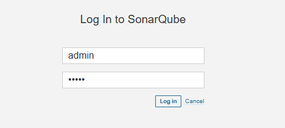
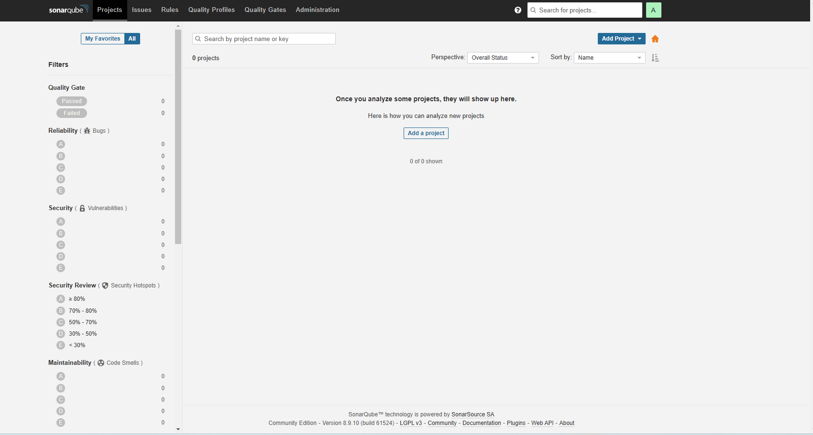

# 安装SonarQube

SonarQube是一个用于持续检查代码质量的开源平台。它可以帮助开发团队发现代码中的问题，并提供改进建议。SonarQube支持多种编程语言，包括Java、JavaScript、Python等

SonarQube依赖于数据库来存储审查结果，Java版本是Java 11
* SonarQube从6.0开始，不再支持MySQL

这里将SonarQube和Jenkins安装在一起，所以OpenJDK


## 1. 安装MySQL()

### 1.1 安装MySQL Yum仓库
```
wget https://dev.mysql.com/get/mysql80-community-release-el7-5.noarch.rpm
yum localinstall mysql80-community-release-el7-5.noarch.rpm
```

### 1.2 选择MySQL版本（可选）
```
# 禁用MySQL 8.0仓库
sudo yum-config-manager --disable mysql80-community

# 启用MySQL 5.7仓库
sudo yum-config-manager --enable mysql57-community
```

### 1.3 安装MySQL服务
```
yum install mysql-community-server
```

### 1.4 启动MySQL服务并设置开机自启
```
systemctl start mysqld
systemctl enable mysqld
```

### 1.5 查看初始密码
在MySQL 5.7及以上版本中，安装完成后会生成一个初始密码。可以通过以下命令查看
```
# grep 'temporary password' /var/log/mysqld.log
2025-02-23T10:46:34.561491Z 1 [Note] A temporary password is generated for root@localhost: Y.4yeXgzgEXL
```

### 1.6 安全配置MySQL
* 使用初始密码登录MySQL，并进行安全配置
```
# 登录MySQL
mysql -u root -p
```

* 登录成功后，首先修改root用户的密码
```
-- 修改root用户密码
ALTER USER 'root'@'localhost' IDENTIFIED BY 'Root@123';
```

* 进行安全配置
```
-- 移除匿名用户
DELETE FROM mysql.user WHERE User='';

-- 禁止root用户远程登录
DELETE FROM mysql.user WHERE User='root' AND Host NOT IN ('localhost', '127.0.0.1', '::1');

-- 移除测试数据库
DROP DATABASE IF EXISTS test;
DELETE FROM mysql.db WHERE Db='test' OR Db='test\\_%';

-- 刷新权限
FLUSH PRIVILEGES;
```

### 1.7. 配置远程访问（可选）
* 修改MySQL配置文件
```
vi /etc/my.cnf
```

* 在文件中添加或修改以下内容
```
bind-address = 0.0.0.0
```

* 重启MySQL服务
```
[root@jenkins mysql]# vim /etc/my.cnf
[root@jenkins mysql]# netstat -nultp | grep mysql
tcp6       0      0 :::3306                 :::*                    LISTEN      50912/mysqld        
[root@jenkins mysql]# 
[root@jenkins mysql]# 
[root@jenkins mysql]# systemctl restart mysqld
[root@jenkins mysql]# 
[root@jenkins mysql]# netstat -nultp | grep mysql
tcp        0      0 0.0.0.0:3306            0.0.0.0:*               LISTEN      51019/mysqld
```
从上面可以看出，MySQL默认是监听在所有端口，包括IPv6

* 创建允许远程访问的用户
```
-- 创建一个新用户，例如jerry，并设置密码为Jerry@123
CREATE USER 'jerry'@'%' IDENTIFIED BY 'Jerry@123';

-- 授予该用户所有权限
GRANT ALL PRIVILEGES ON *.* TO 'jerry'@'%';

-- 刷新权限
FLUSH PRIVILEGES;
```

### 1.8 防火墙配置
```
# 开放3306端口
firewall-cmd --permanent --add-port=3306/tcp

# 重新加载防火墙规则
firewall-cmd --reload
```

## 1. 安装PostgreSQL 
### 1.1 添加 PostgreSQL 存储库
```
# 下载并安装 PostgreSQL 存储库 RPM 包
sudo yum install -y https://download.postgresql.org/pub/repos/yum/reporpms/EL-7-x86_64/pgdg-redhat-repo-latest.noarch.rpm
```

### 1.2 安装 PostgreSQL
```
# 安装 PostgreSQL 14 服务器和客户端
yum install -y postgresql14-server postgresql14
```

### 1.3 初始化 PostgreSQL
```
# 初始化 PostgreSQL 数据库
/usr/pgsql-14/bin/postgresql-14-setup initdb
```

### 1.4 启动并设置开机自启
```
# 启动 PostgreSQL 服务
systemctl start postgresql-14

# 设置 PostgreSQL 服务开机自启
systemctl enable postgresql-14
```

### 1.5 配置 PostgreSQL 远程访问（可选）
#### 1.5.1 修改 postgresql.conf 文件
```
vi /var/lib/pgsql/14/data/postgresql.conf
```
找到 listen_addresses 参数，将其修改为
```
listen_addresses = '*'
```

#### 1.5.2 修改 pg_hba.conf 文件
```
vi /var/lib/pgsql/14/data/pg_hba.conf
```
在文件末尾添加以下内容, 允许所有 IP 地址以密码验证方式连接：
```
host    all             all             0.0.0.0/0               md5
```

#### 1.5.3 重启 PostgreSQL 服务
```
systemctl restart postgresql-14
```

### 1.6 防火墙配置
```
# 开放 5432 端口
sudo firewall-cmd --permanent --add-port=5432/tcp

# 重新加载防火墙规则
sudo firewall-cmd --reload
```

### 1.7 创建新用户和数据库
默认情况下，PostgreSQL会创建一个名为postgres的系统用户和数据库用户。可以切换到该用户并创建新的数据库和用户
```
# 切换到 postgres 用户
sudo -u postgres psql

# 在 PostgreSQL 命令行中创建新用户，例如jerry，并设置密码为Jerry@123
CREATE USER jerry WITH PASSWORD 'Jerry@123';

# 创建新数据库，例如 testdb jerry
CREATE DATABASE testdb OWNER jerry;

# 退出 PostgreSQL 命令行
\q
```

## 2. 安装SonarQube
下载地址，https://www.sonarsource.com/products/sonarqube/downloads/
https://www.sonarsource.com/products/sonarqube/downloads/historical-downloads/

### 2.1 创建数据库名为sonar的数据库
```
CREATE DATABASE sonar OWNER jerry;
```

### 2.2 下载解压SonarQube，并设置权限
```
wget https://binaries.sonarsource.com/Distribution/sonarqube/sonarqube-8.9.10.61524.zip
unzip sonarqube-8.9.10.61524.zip
mkdir /opt/sonar
mv /tmp/sonarqube-8.9.10.61524/* /opt/sonar/
useradd sonar # 创建sonar用户，无法以root账户运行，所以建立一个sonar用户
chown -R sonar:sonar /opt/sonar
```

### 2.3 修改配置文件
```
vi /opt/sonar/conf/sonar.properties
```
修改内容如下：
```
# 数据库配置
sonar.jdbc.username=jerry
sonar.jdbc.password=Jerry@123
sonar.jdbc.url=jdbc:postgresql://localhost:5432/sonar

# 端口配置， 默认配置，可以不修改
sonar.web.port=9000
```
* sonarqube默认使用9000端口，如果9000端口被占用，可以修改为其他端口

### 2.4 启动SonarQube
* 启动
```
su sonar /opt/sonar/bin/linux-x86-64/sonar.sh start
```
* 停止
```
su sonar /opt/sonar/bin/linux-x86-64/sonar.sh stop
```
* 查看状态
```
su sonar /opt/sonar/bin/linux-x86-64/sonar.sh status
```

### 2.5 http://192.168.50.135:9000/ 访问SonarQube


* 默认用户名和密码是admin/admin



* 登录之后会要求修改密码，新的密码不能老的密码一样，否则无法失败



----
## 问题
## 1. SonarQube启动失败
```
ERROR: [2] bootstrap checks failed. You must address the points described in the following [2] lines before starting Elasticsearch.
bootstrap check failure [1] of [2]: max file descriptors [4096] for elasticsearch process is too low, increase to at least [65535]
bootstrap check failure [2] of [2]: max virtual memory areas vm.max_map_count [65530] is too low, increase to at least [262144]
ERROR: Elasticsearch did not exit normally - check the logs at /opt/sonar/logs/sonarqube.log
2025.02.23 21:50:55 WARN  app[][o.s.a.p.AbstractManagedProcess] Process exited with exit value [es]: 78
2025.02.23 21:50:55 INFO  app[][o.s.a.SchedulerImpl] Process[es] is stopped
2025.02.23 21:50:55 INFO  app[][o.s.a.SchedulerImpl] SonarQube is stopped
```
=>
* 编辑 /etc/security/limits.conf, 在文件末尾添加以下内容
```
sonar hard nofile 65535 # sonar 为sonar用户, 如果是其他用户运行sonarqube，需要修改为其他用户
sonar soft nofile 65535 # sonar 为sonar用户
```

* 编辑 /etc/sysctl.conf 文件，添加或修改以下内容
```
fs.file-max = 65535
vm.max_map_count = 262144
```

* 执行以下命令使修改生效
```
sysctl -p
```