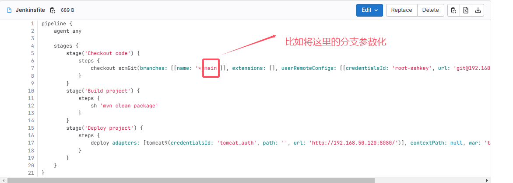
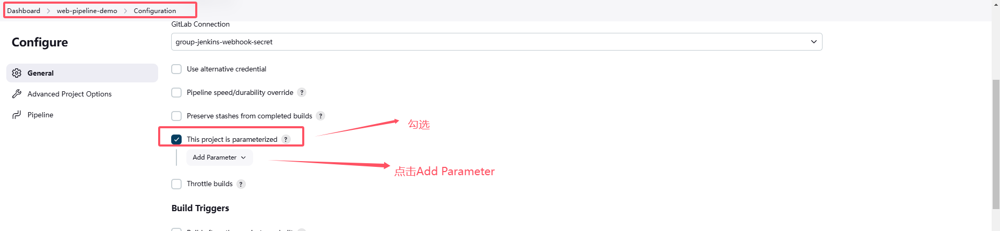
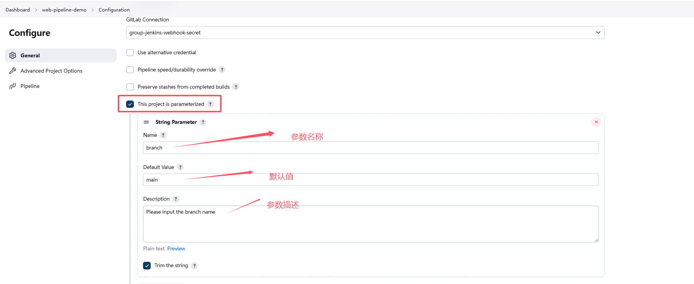
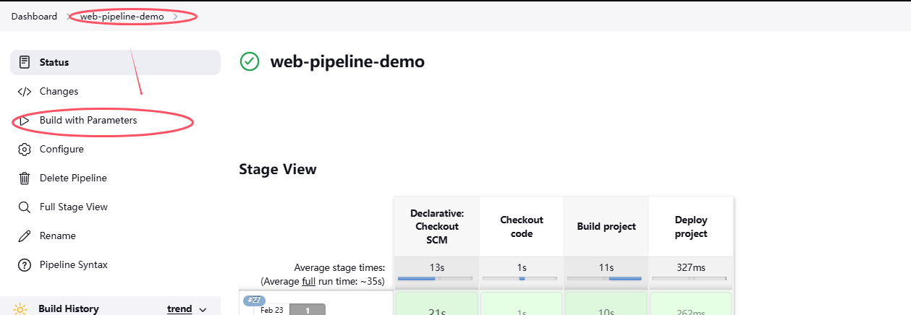
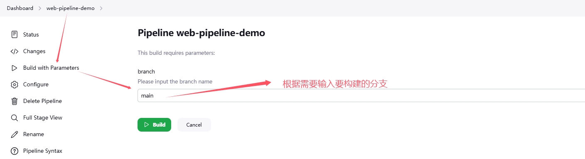
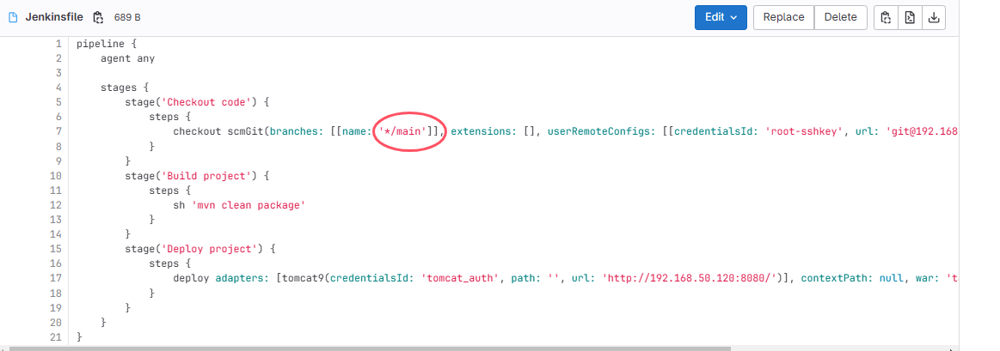
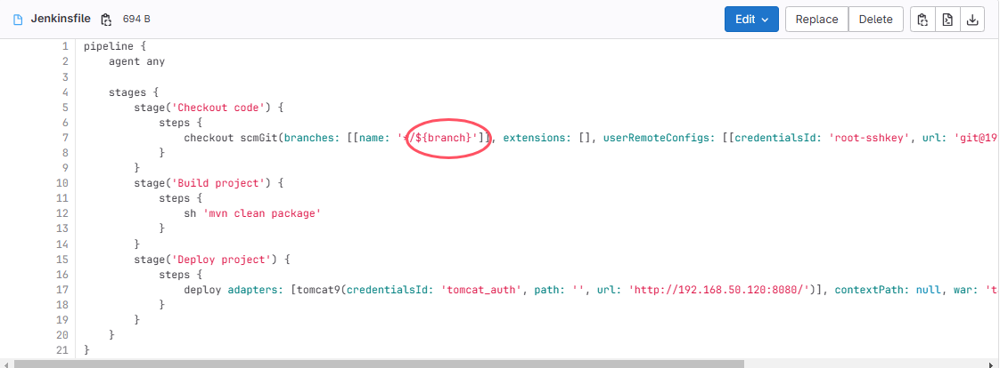
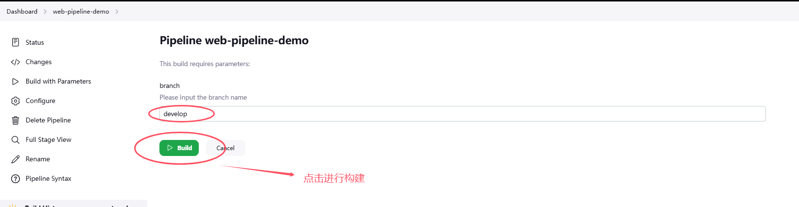
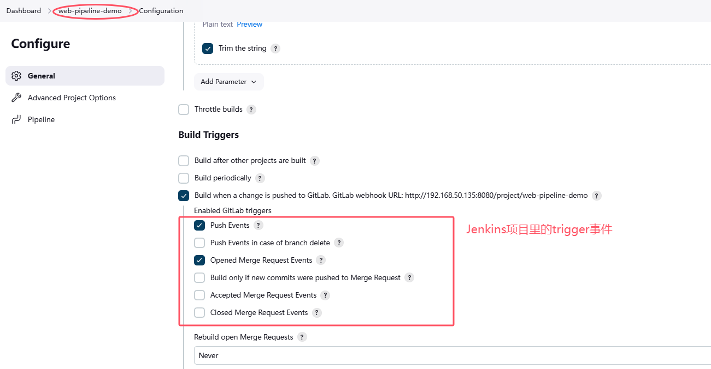
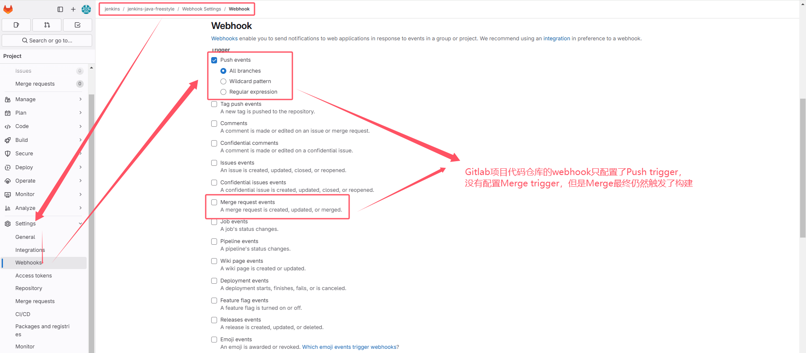

# 参数化构建

* 需求如下

**这里有点要注意：当通过Gitlab webhook或Integration通过trigger事件触发的时候，branch的值将是事件触发时代码所在的branch**

## 1. 配置参数

添加上述配置之后，就可以在项目的导航栏`Build with Parameters`

点击`Build with Parameters`，进入参数配置页面

## 2. 更改Jenksinfile

将`main`修改为`${branch}`

## 3. 构建

## 问题
* Jenkins项目配置的trigger事件，包含Merge

* Gitlab项目配置的webhook，没有包含Merge

* 但是Merge分支的时候仍然触发了构建，这两个地方的配置是优先级高低的的问题，还是两处的配置进行了合并
  * 应该是合并的关系，Jenkins项目的配置中取消了Merge的trigger，Gitlab项目的webhook配置中包含了Merge，最终触发了构建