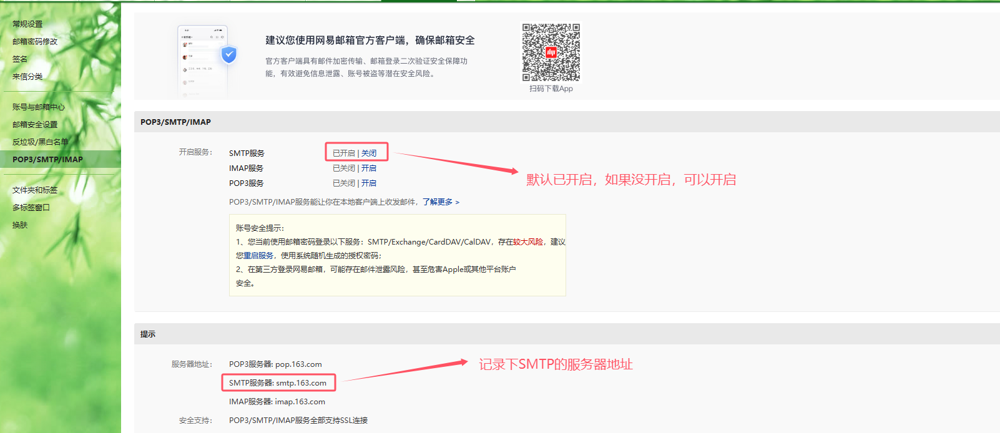
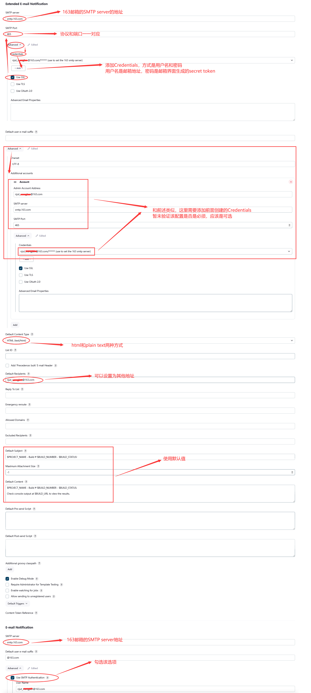

# 配置email发送构建结果

## 1. 安装插件
在Jenkins中安装Email Extension插件


## 2. 配置邮件服务器
### 3.1 网易邮箱
* 打开SMPA设置

* 开启SMTP服务
  * 如果已经开启，可以先关闭，然后再开启，这样会生成授权码


* 生成授权码
  * 记录下生成的授权码
  
  
  

### 3.2 QQ邮箱


## 2. 配置全局参数
* 配置系统管理员邮箱
> Manage Jenkins -> Configure System -> System -> Jenkins Location


* 配置邮件通知
> Manage Jenkins -> Configure System -> System -> Extended E-mail Notification




* 所有的地方都勾选`Use SSL`，不是`Use TLS`

## 3. 配置项目——邮件发送构建结果

### 3.1 准备邮件发送模板
* 放在Gitlab项目所在的根目录，和Jenkinsfile同级
**email.html**
```
<!DOCTYPE html>
<html>
<head>
    <meta charset="UTF-8">
    <title>${ENV, var="JOB_NAME"}-第${BUILD_NUMBER}次构建日志</title>
    <style>
        body {
            font-size: 11pt;
            font-family: Tahoma, Arial, Helvetica, sans-serif;
        }
        h2 {
            color: #0000FF;
        }
        b {
            color: #0B610B;
        }
        hr {
            size="2" width="100%" align="center";
        }
    </style>
</head>
<body leftmargin="8" marginwidth="0" topmargin="8" marginheight="4" offset="0">
    <table width="95%" cellpadding="0" cellspacing="0">
        <tr>
            <td>（本邮件是程序自动下发的，请勿回复！）</td>
        </tr>
        <tr>
            <td><h2>构建结果 - ${BUILD_STATUS}</h2></td>
        </tr>
        <tr>
            <td><br />
            <b>构建信息</b>
            <hr size="2" width="100%" align="center" /></td>
        </tr>
        <tr>
            <td>
                <ul>
                    <li>项目名称：web_demo_pipeline</li>
                    <li>构建编号：第28次构建</li>
                    <li>触发原因：Started by user admin</li>
                    <li>构建日志：http://192.168.66.101:8888/job/web_demo_pipeline/28/console</li>
                    <li>构建 Url：http://192.168.66.101:8888/job/web_demo_pipeline/28/</li>
                    <li>工作目录：http://192.168.66.101:8888/job/web_demo_pipeline/ws</li>
                    <li>项目 Url：http://192.168.66.101:8888/job/web_demo_pipeline/</li>
                </ul>
            </td>
        </tr>
        <tr>
            <td>
                <h3>Changes Since Last Successful Build:</h3>
                <ul>
                    <li>历史变更记录：http://192.168.66.101:8888/job/web_demo_pipeline/changes</li>
                    <li>Changes for Build #28: No changes</li>
                </ul>
            </td>
        </tr>
        <tr>
            <td>
                <h3>Failed Test Results</h3>
                <ul>
                    <li>No tests ran.</li>
                </ul>
            </td>
        </tr>
    </table>
</body>
</html>
```

### 3.2 更新Jenkinsfile
```
pipeline {
    agent any

    stages {
        stage('Checkout code') {
            steps {
                checkout scmGit(branches: [[name: '*/${branch}']], extensions: [], userRemoteConfigs: [[credentialsId: 'root-sshkey', url: 'git@192.168.50.130:jenkins/jenkins-java-freestyle.git']])
            }
        }
        stage('Build project') {
            steps {
                sh 'mvn clean package'
            }
        }
        stage('Deploy project') {
            steps {
                deploy adapters: [tomcat9(credentialsId: 'tomcat_auth', path: '', url: 'http://192.168.50.120:8080/')], contextPath: null, war: 'target/*.war'
            }
        }
    }
    post {
        always {
            emailext(
                subject: '构建通知: ${PROJECT_NAME} - Build # ${BUILD_NUMBER} - ${BUILD_STATUS} !',
                body: '${FILE,path="email.html"}',
                to: 'xxx@qq.com'
            )
        }
    }
}
```
* PROJECT_NAME等是Jenkins内置变量
> Manage Jenkins -> Configure System -> System -> Content Token Reference


* post语法

  

  
  可以按需选择触发的条件

  

* emailext


### 3.3 测试配置
* 测试配置通过，不一定说明构建的时候邮件可以正常发送，详细参考问题2


### 3.4 构建成功，邮件发送成功


---

## 问题
## 1. org.eclipse.angus.mail.smtp.SMTPSenderFailedException: 553 Mail from must equal authorized user

=> 
> Manage Jenkins -> Configure System -> System -> Jenkins Location
* 需要将`System Admin e-mail address`的邮件地址配置为`发件人`的邮箱地址


## 2. 邮件发送失败 -- Not sent to the following valid addresses


=> 
在配置邮件服务器的时候，测试是成功的，但是构建的时候却发送失败，需要检查邮件服务器是否支持`匿名`发送邮件

打开构建的debug日志开关
> Manage Jenkins -> Configure System -> System -> Extended E-mail Notification


重新build后可以在日志中看到如下错误，`org.eclipse.angus.mail.smtp.SMTPSendFailedException: 553 authentication is required`


=>
> Manage Jenkins -> Configure System -> System -> Extended E-mail Notification
* 添加Credentials, 


