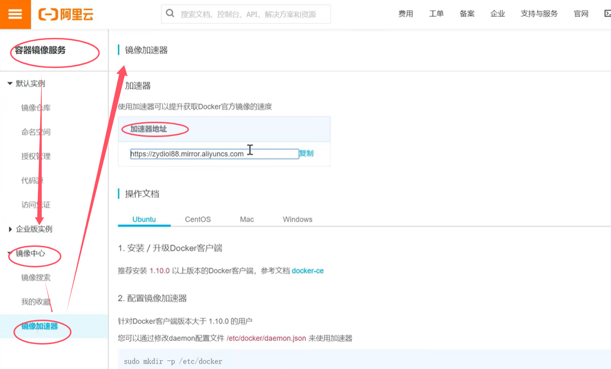

# docker installation

## 1. Centos7安装docker

* 步骤 1：更新系统
```
sudo yum update -y
```

* 步骤 2：卸载旧版本的 Docker（如果有）
```
sudo yum remove docker \
                  docker-client \
                  docker-client-latest \
                  docker-common \
                  docker-latest \
                  docker-latest-logrotate \
                  docker-logrotate \
                  docker-engine
```

* 步骤 3：安装必要的依赖包
```
sudo yum install -y yum-utils device-mapper-persistent-data lvm2
```

* 步骤 4：添加 Docker 官方软件源
```
sudo yum-config-manager --add-repo https://download.docker.com/linux/centos/docker-ce.repo
```

* 步骤 5：安装 Docker Engine
```
sudo yum install docker-ce docker-ce-cli containerd.io
```

* 步骤 6：启动并设置 Docker 开机自启
```
sudo systemctl start docker
sudo systemctl enable docker
```

* 步骤 7：验证 Docker 安装
```
sudo docker run hello-world
```
如下输出
```
Hello from Docker!
This message shows that your installation appears to be working correctly.
...
```

---
* 可以通过以下命令查看docker可用版本
```
yum list docker-ce --showduplicates | sort -r
```
* 安装指定版本
```
yum install docker-ce-<VERSION_STRING> docker-ce-cli-<VERSION_STRING> 
```
* 添加docker国内阿里云镜像源, 然后重启docker服务
> vi /etc/docker/daemon.json
```
{
  "registry-mirrors": ["https://zydio188.mirror.aliyuncs.com"]
}
```

* 阿里云会为每个用户提供镜像加速地址




## 2. 常用命令

## 3. Dockerfile
命令                   作用

FROM image_name:tag  

MAINTAINER user_name 声明镜像的作者

ENV key value       设置环境变量(可以写多条)

RUN command         编译镜像时运行的脚本(可以写多条)

CMD                 设置容器的启动命令

ENTRYPOINT          设置容器的入口程序

ADD source_dir/file dest_dir/file 将宿主机的文件复制到容器内，如果是一个压缩文件，将会在复制后自动解压

COPY source_dir/file dest_dir/file 和ADD相似，但是如果有压缩文件并不能解压

WORKDIR path_dir    设置工作目录

ARG                 设置编译镜像时加入的参数

VOLUME              设置容器的挂载卷


* Dockerfile中CMD和ENTRYPOINT的区别
> CMD是无法接入容器运行过程中传入参数，而ENTRYPOINT可以

> CMD：设置容器的启动命令，Dockerfile 中只能有一条 CMD 命令，如果写了多条则最后一条生效，CMD不支持接收docker run的参数。

> ENTRYPOINT：入口程序是容器启动时执行的程序，docker run 中最后的命令将作为参数传递给入口程序，ENTRYPOINT类似于 CMD 指令，但可以接收docker run的参数。