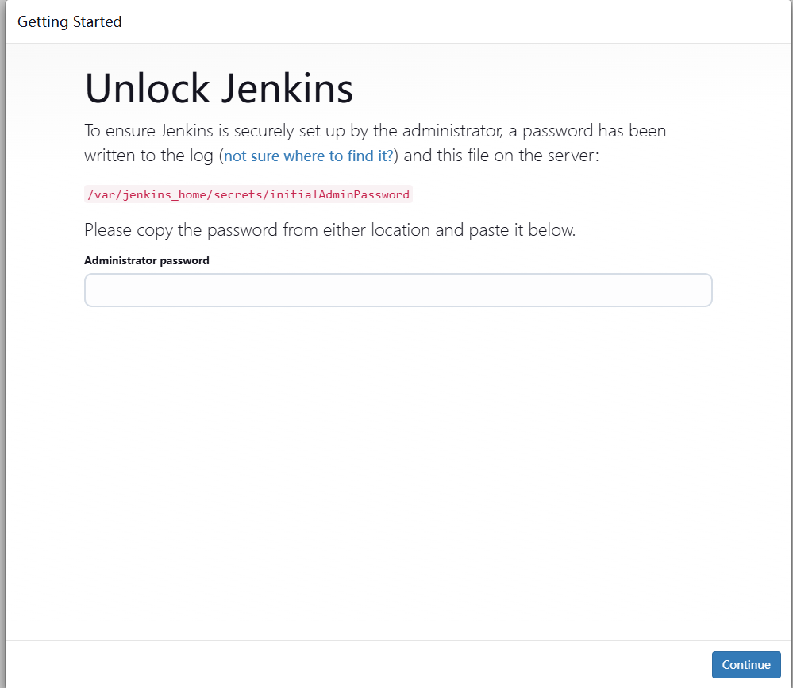
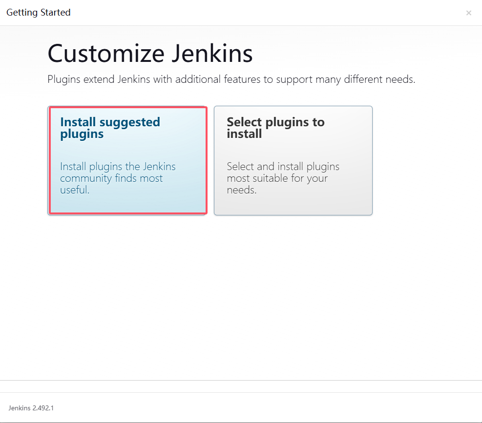
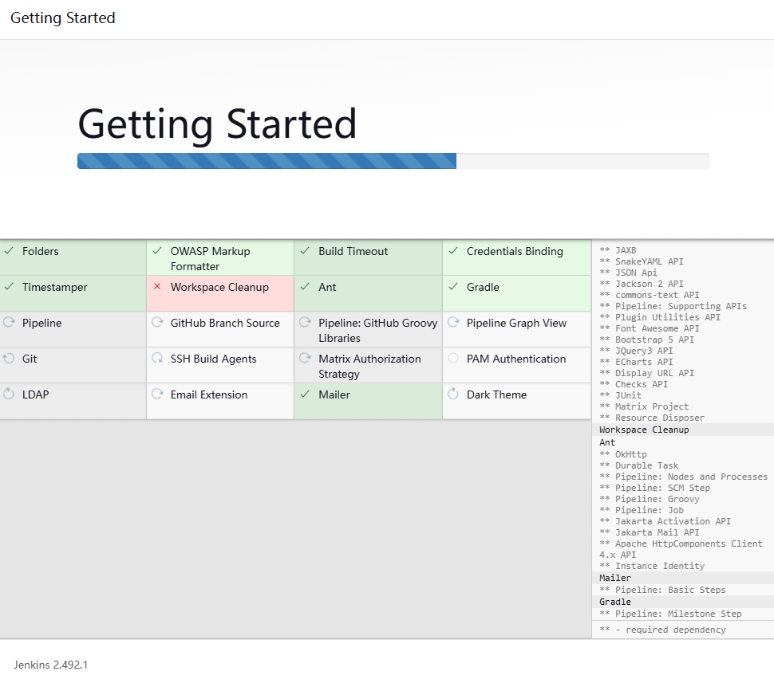
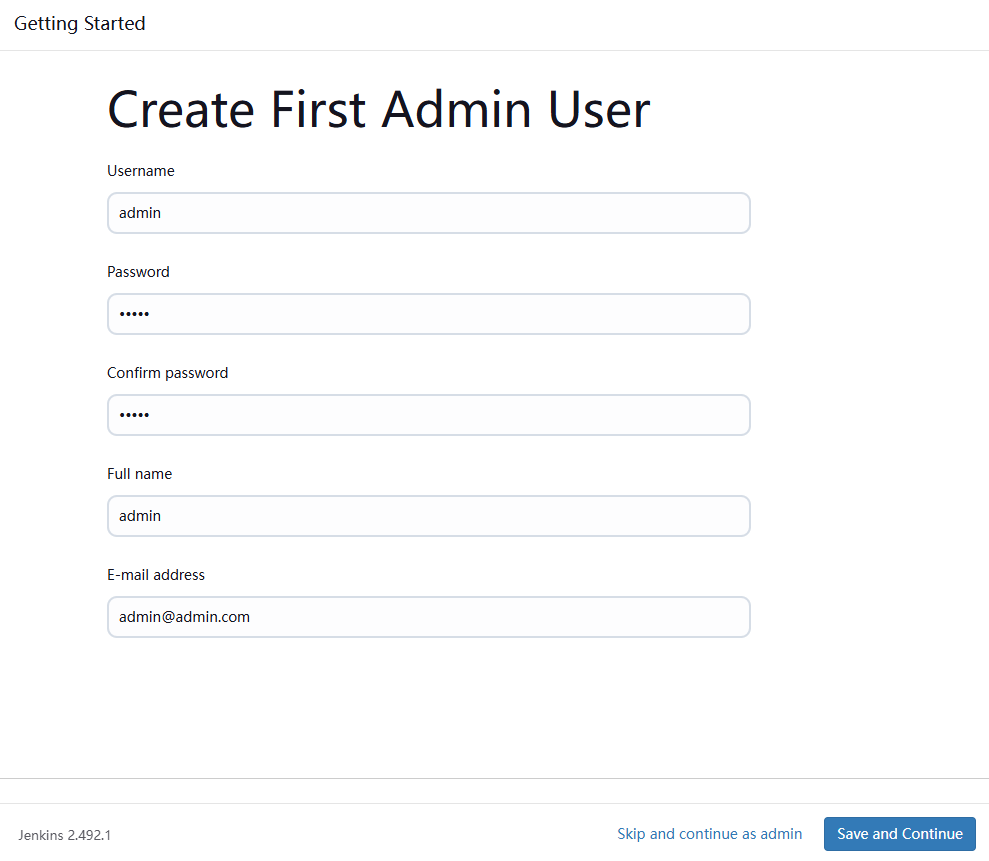
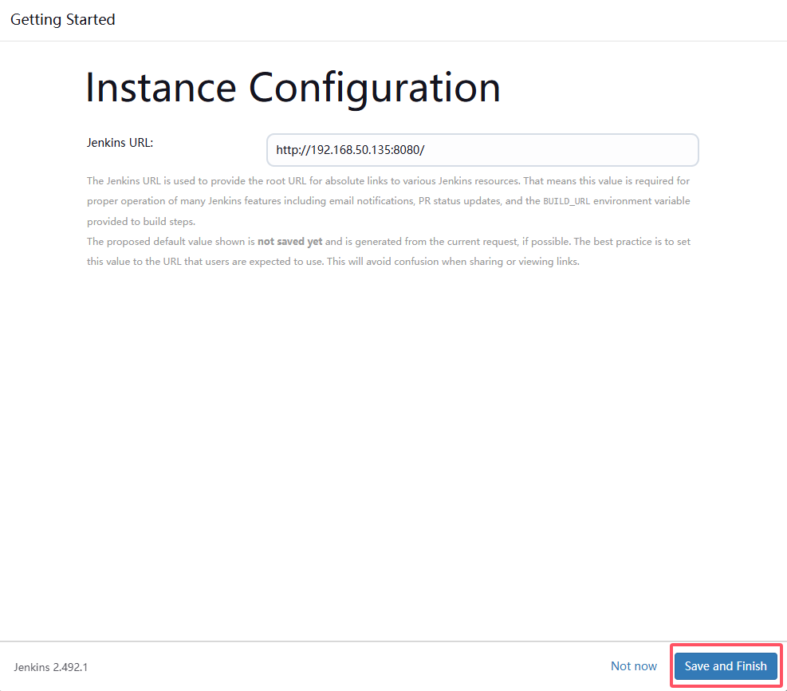
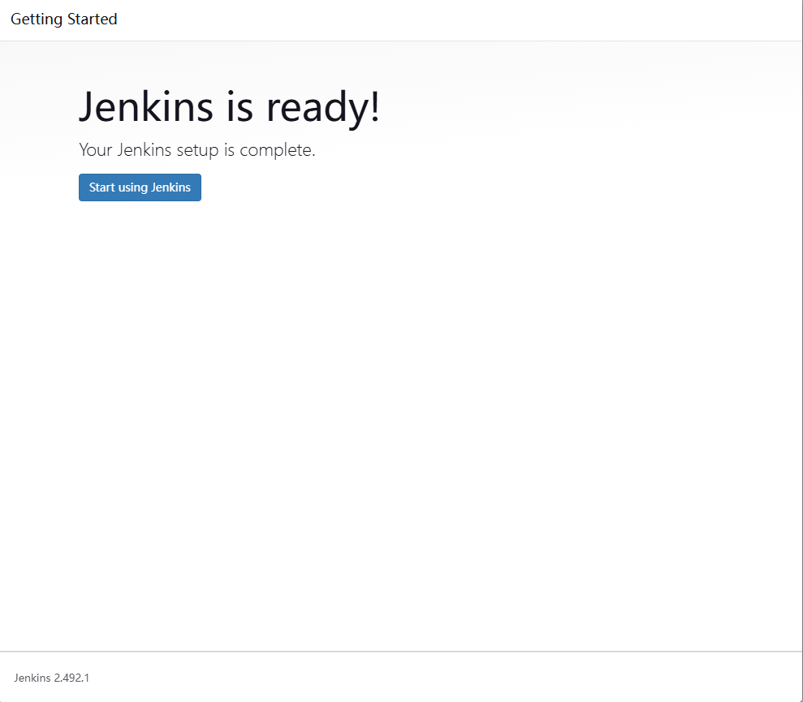
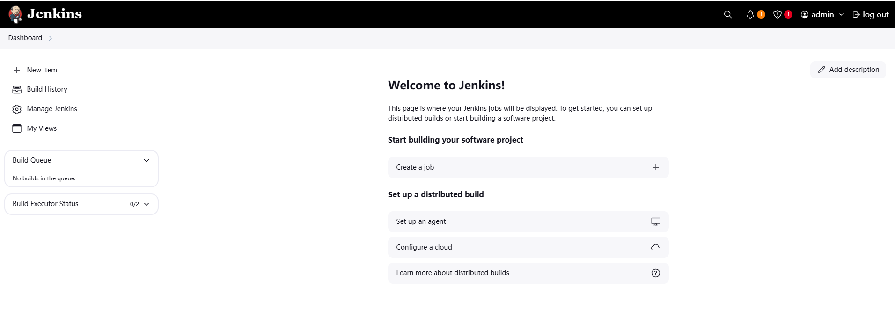

# jenkins installation

**Jenkins的版本是2.492.1**

Jenkins和Java版本对应关系，https://www.jenkins.io/doc/book/platform-information/support-policy-java/

## 1. rpm安装包
### 1. install jdk
* 这里安装的是jdk 11，或者只需要安装jre，更为轻量
```
yum install -y java-11-openjdk*
```
* 安装目录为: **/usr/lib/jvm**

### 2. install jenkins
#### 2.1 获取Jenkins安装包
```
https://www.jenkins.io/doc/book/installing/linux/#fedora
```

#### 2.2 配置Jenkins yum源
```
wget -O /etc/yum.repos.d/jenkins.repo https://pkg.jenkins.io/redhat-stable/jenkins.repo
rpm --import https://pkg.jenkins.io/redhat-stable/jenkins.io-2023.key
yum upgrade
```

#### 2.3 安装Jenkins
```
yum --showduplicates list jenkins # 查看可安装的版本
yum install jenkins-2.426.1-1.1 # jenkins-<version>
```
#### 2.4 查看Jenkins状态
```
[root@jenkins sysconfig]# systemctl status jenkins
● jenkins.service - Jenkins Continuous Integration Server
   Loaded: loaded (/usr/lib/systemd/system/jenkins.service; disabled; vendor preset: disabled)
   Active: active (running) since Fri 2025-02-21 00:10:05 CST; 1min 47s ago
 Main PID: 31499 (java)
    Tasks: 46
   Memory: 2.2G
   CGroup: /system.slice/jenkins.service
           └─31499 /usr/bin/java -Djava.awt.headless=true -jar /usr/share/java/jenkins.war --webroot=%C/jenkins/war --httpPort=8080

Feb 21 00:09:20 jenkins jenkins[31499]: 788e21d84aa646079c96fb80c88e5b92
Feb 21 00:09:20 jenkins jenkins[31499]: This may also be found at: /var/lib/jenkins/secrets/initialAdminPassword
Feb 21 00:09:20 jenkins jenkins[31499]: *************************************************************
Feb 21 00:09:20 jenkins jenkins[31499]: *************************************************************
Feb 21 00:09:20 jenkins jenkins[31499]: *************************************************************
Feb 21 00:10:05 jenkins jenkins[31499]: 2025-02-20 16:10:05.421+0000 [id=37]        INFO        jenkins.InitReactorRunner$1#onAttained: Completed initialization
Feb 21 00:10:05 jenkins jenkins[31499]: 2025-02-20 16:10:05.448+0000 [id=23]        INFO        hudson.lifecycle.Lifecycle#onReady: Jenkins is fully up and running
Feb 21 00:10:05 jenkins systemd[1]: Started Jenkins Continuous Integration Server.
Feb 21 00:10:08 jenkins jenkins[31499]: 2025-02-20 16:10:08.831+0000 [id=52]        INFO        h.m.DownloadService$Downloadable#load: Obtained the updated data file for hudson.tasks.Maven.MavenInstaller
Feb 21 00:10:08 jenkins jenkins[31499]: 2025-02-20 16:10:08.834+0000 [id=52]        INFO        hudson.util.Retrier#start: Performed the action check updates server successfully at the attempt #1
```


#### issues
* Unknown lvalue 'StartLimitBurst'
```
[root@jenkins tmp]# systemctl status jenkins
● jenkins.service - Jenkins Continuous Integration Server
   Loaded: loaded (/usr/lib/systemd/system/jenkins.service; disabled; vendor preset: disabled)
   Active: inactive (dead)

Feb 20 22:02:12 jenkins systemd[1]: [/usr/lib/systemd/system/jenkins.service:16] Unknown lvalue 'StartLimitBurst' in section 'Unit'
Feb 20 22:02:12 jenkins systemd[1]: [/usr/lib/systemd/system/jenkins.service:17] Unknown lvalue 'StartLimitIntervalSec' in section 'Unit'
Feb 20 22:02:36 jenkins systemd[1]: [/usr/lib/systemd/system/jenkins.service:16] Unknown lvalue 'StartLimitBurst' in section 'Unit'
Feb 20 22:02:36 jenkins systemd[1]: [/usr/lib/systemd/system/jenkins.service:17] Unknown lvalue 'StartLimitIntervalSec' in section 'Unit'
```

## 2. docker安装
### 2.1 拉取Jenkins镜像(LTS)
```
docker pull docker.1ms.run/jenkins/jenkins:lts
```

### 2.2 启动Jenkins容器
```
mkdir -p /opt/jenkins
chown -R 1000 /opt/jenkins/
docker run -id --name jenkins -p 8080:8080 -v /opt/jenkins:/var/jenkins_home docker.1ms.run/jenkins/jenkins:lts
```
* 查看log
```
# docker logs jenkins
Running from: /usr/share/jenkins/jenkins.war
webroot: /var/jenkins_home/war
2025-02-17 15:28:56.151+0000 [id=1]	INFO	winstone.Logger#logInternal: Beginning extraction from war file
2025-02-17 15:28:58.820+0000 [id=1]	WARNING	o.e.j.ee9.nested.ContextHandler#setContextPath: Empty contextPath
2025-02-17 15:28:59.034+0000 [id=1]	INFO	org.eclipse.jetty.server.Server#doStart: jetty-12.0.16; built: 2024-12-09T21:02:54.535Z; git: c3f88bafb4e393f23204dc14dc57b042e84debc7; jvm 17.0.14+7
2025-02-17 15:29:00.200+0000 [id=1]	INFO	o.e.j.e.w.StandardDescriptorProcessor#visitServlet: NO JSP Support for /, did not find org.eclipse.jetty.ee9.jsp.JettyJspServlet
2025-02-17 15:29:00.405+0000 [id=1]	INFO	o.e.j.s.DefaultSessionIdManager#doStart: Session workerName=node0
2025-02-17 15:29:01.639+0000 [id=1]	INFO	hudson.WebAppMain#contextInitialized: Jenkins home directory: /var/jenkins_home found at: EnvVars.masterEnvVars.get("JENKINS_HOME")
2025-02-17 15:29:01.949+0000 [id=1]	INFO	o.e.j.s.handler.ContextHandler#doStart: Started oeje9n.ContextHandler$CoreContextHandler@7d199c68{Jenkins v2.492.1,/,b=file:///var/jenkins_home/war/,a=AVAILABLE,h=oeje9n.ContextHandler$CoreContextHandler$CoreToNestedHandler@63411512{STARTED}}
2025-02-17 15:29:01.983+0000 [id=1]	INFO	o.e.j.server.AbstractConnector#doStart: Started ServerConnector@4d192aef{HTTP/1.1, (http/1.1)}{0.0.0.0:8080}
2025-02-17 15:29:02.020+0000 [id=1]	INFO	org.eclipse.jetty.server.Server#doStart: Started oejs.Server@5b444398{STARTING}[12.0.16,sto=0] @7470ms
2025-02-17 15:29:02.034+0000 [id=25]	INFO	winstone.Logger#logInternal: Winstone Servlet Engine running: controlPort=disabled
2025-02-17 15:29:02.407+0000 [id=24]	INFO	jenkins.model.Jenkins#<init>: Starting version 2.492.1
2025-02-17 15:29:02.611+0000 [id=33]	INFO	jenkins.InitReactorRunner$1#onAttained: Started initialization
2025-02-17 15:29:02.638+0000 [id=31]	INFO	jenkins.InitReactorRunner$1#onAttained: Listed all plugins
2025-02-17 15:29:05.357+0000 [id=38]	INFO	jenkins.InitReactorRunner$1#onAttained: Prepared all plugins
2025-02-17 15:29:05.368+0000 [id=38]	INFO	jenkins.InitReactorRunner$1#onAttained: Started all plugins
2025-02-17 15:29:05.369+0000 [id=31]	INFO	jenkins.InitReactorRunner$1#onAttained: Augmented all extensions
2025-02-17 15:29:05.706+0000 [id=31]	INFO	jenkins.InitReactorRunner$1#onAttained: System config loaded
2025-02-17 15:29:05.707+0000 [id=31]	INFO	jenkins.InitReactorRunner$1#onAttained: System config adapted
2025-02-17 15:29:05.707+0000 [id=31]	INFO	jenkins.InitReactorRunner$1#onAttained: Loaded all jobs
2025-02-17 15:29:05.711+0000 [id=31]	INFO	jenkins.InitReactorRunner$1#onAttained: Configuration for all jobs updated
2025-02-17 15:29:05.792+0000 [id=51]	INFO	hudson.util.Retrier#start: Attempt #1 to do the action check updates server
2025-02-17 15:29:06.431+0000 [id=33]	INFO	jenkins.install.SetupWizard#init: 

*************************************************************
*************************************************************
*************************************************************

Jenkins initial setup is required. An admin user has been created and a password generated.
Please use the following password to proceed to installation:

9156787b70d34411be6163ddf50f0c29

This may also be found at: /var/jenkins_home/secrets/initialAdminPassword

*************************************************************
*************************************************************
*************************************************************

2025-02-17 15:29:18.949+0000 [id=33]	INFO	jenkins.InitReactorRunner$1#onAttained: Completed initialization
2025-02-17 15:29:18.992+0000 [id=24]	INFO	hudson.lifecycle.Lifecycle#onReady: Jenkins is fully up and running
2025-02-17 15:29:35.118+0000 [id=51]	INFO	h.m.DownloadService$Downloadable#load: Obtained the updated data file for hudson.tasks.Maven.MavenInstaller
2025-02-17 15:29:35.119+0000 [id=51]	INFO	hudson.util.Retrier#start: Performed the action check updates server successfully at the attempt #1

```

* 如果不设置/opt/jenkins目录权限，可能会出现权限问题，导致Jenkins启动失败
```
# docker logs jenkins
INSTALL WARNING: User:  missing rw permissions on JENKINS_HOME: /var/jenkins_home
touch: cannot touch '/var/jenkins_home/copy_reference_file.log': Permission denied
Can not write to /var/jenkins_home/copy_reference_file.log. Wrong volume permissions?
```

### 2.3 访问Jenkins

* 可以从Jenkins docker的启动日志或者容器的`/var/jenkins_home/secrets/initialAdminPassword`文件中获取初始密码
* 可以输入初始密码，进行后续的操作


* 可以选择安装推荐的插件，也可以选择自定义安装插件
* 这里选择安装推荐的插件，如果失败可以重试几次；如果仍然失败，可以后续通过手动方式进行安装



* 安装完成后，创建一个管理员账户，并设置密码(admin/admin)


* 设置Jenkins访问url，然后点`Save and Continue`


* 完成后，就可以使用Jenkins了




### 2.4 安装插件
* 如果安装推荐的插件失败，可以手动安装插件
* 在Jenkins的插件管理页面，点击“可选插件”选项卡，然后点击“浏览”按钮，输入插件名称，然后点击“安装”按钮
* 安装完成后，重启Jenkins

### 2.5 配置Jenkins