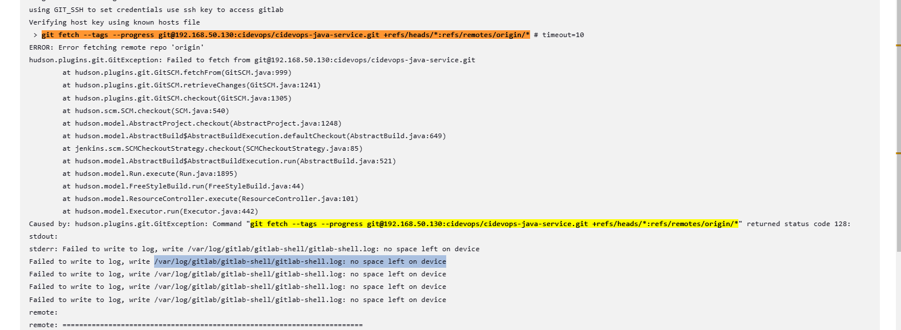

# maven

## 安装jdk
```
[root@jenkins tmp]# yum install -y java-11-openjdk*
[root@jenkins tmp]# java -version
openjdk version "11.0.23" 2024-04-16 LTS
OpenJDK Runtime Environment (Red_Hat-11.0.23.0.9-2.el7_9) (build 11.0.23+9-LTS)
OpenJDK 64-Bit Server VM (Red_Hat-11.0.23.0.9-2.el7_9) (build 11.0.23+9-LTS, mixed mode, sharing)
```

## 安装maven
* 创建maven目录
```
[root@jenkins opt]#mkdir /opt/maven
```
* 下载maven安装包
```
[root@jenkins tmp]# wget https://dlcdn.apache.org/maven/maven-3/3.9.5/binaries/apache-maven-3.9.5-bin.tar.gz
[root@jenkins tmp]# tar -zxvf apache-maven-3.9.5-bin.tar.gz
```
* 移动到maven目录
```
[root@jenkins tmp]# mv /tmp/apache-maven-3.9.5/* /opt/maven/
[root@jenkins tmp]# ll /opt/maven/
total 36
drwxr-xr-x. 2 root root    97 Feb 20 20:55 bin
drwxr-xr-x. 2 root root    76 Feb 20 20:55 boot
drwxr-xr-x. 3 root root    63 Oct  2  2023 conf
drwxr-xr-x. 4 root root  4096 Feb 20 20:55 lib
-rw-r--r--. 1 root root 18933 Oct  2  2023 LICENSE
-rw-r--r--. 1 root root  5034 Oct  2  2023 NOTICE
-rw-r--r--. 1 root root  2533 Oct  2  2023 README.txt
```

## 配置环境变量
> vi /etc/profile
```
export JAVA_HOME=/usr/lib/jvm/java-11-openjdk
export MAVEN_HOME=/opt/maven
export PATH=$JAVA_HOME/bin:$MAVEN_HOME/bin:$PATH
```
> source /etc/profile
```
[root@jenkins tmp]# source /etc/profile
[root@jenkins tmp]# mvn -v
```

## 全局工具配置关联JDK和maven
> Jenkins -> Manage Jenkins -> System Configuration -> Tools

* 新增JDK


* 新增Maven


因为Java和Maven已经在host上安装了，所以这里勾选`Install automatically`去安装


## 添加Jenkins全局变量
* JAVA_HOME: /usr/lib/jvm/java-11-openjdk
* M2_HOME: /opt/maven
* PATH+EXTRA: $M2_HOME/bin
> Jenkins -> Manage Jenkins -> System Configuration -> System


## 修改Maven的settings.xml
* 创建本地仓库目录
```
mkdir -p /opt/maven_repository # 用于存储Maven的一些依赖
```
* 修改 /opt/maven/conf/settings.xml
```
<localRepository>/opt/maven_repository</localRepository>
```
* 添加阿里云私服地址
```
<mirror>
  <id>alimaven</id>
  <name>aliyun maven</name>
  <url>http://maven.aliyun.com/nexus/content/groups/public/</url>
  <mirrorOf>central</mirrorOf>
</mirror>
```
* 验证
  * 从阿里云下载依赖
  
  * 依赖下载和打包好的jar包
  
  
---
## 问题
### 1. mvn: command not found


=>
按照`全局工具配置关联JDK和maven`和`添加Jenkins全局变量`的步骤进行配置

### 2. ERROR: Error fetching remote repo 'origin'
```
[INFO] Currently running in a labeled security context
[INFO] Currently SELinux is 'enforcing' on the host
 > /usr/bin/chcon --type=ssh_home_t /var/lib/jenkins/workspace/cidevops01@tmp/jenkins-gitclient-ssh15128757539762415673.key
Verifying host key using known hosts file
 > git fetch --tags --progress git@192.168.50.130:cidevops/cidevops-java-service.git +refs/heads/*:refs/remotes/origin/* # timeout=10
ERROR: Error fetching remote repo 'origin'
hudson.plugins.git.GitException: Failed to fetch from git@192.168.50.130:cidevops/cidevops-java-service.git
	at hudson.plugins.git.GitSCM.fetchFrom(GitSCM.java:999)
	at hudson.plugins.git.GitSCM.retrieveChanges(GitSCM.java:1241)
	at hudson.plugins.git.GitSCM.checkout(GitSCM.java:1305)
	at hudson.scm.SCM.checkout(SCM.java:540)
	at hudson.model.AbstractProject.checkout(AbstractProject.java:1248)
	at hudson.model.AbstractBuild$AbstractBuildExecution.defaultCheckout(AbstractBuild.java:649)
	at jenkins.scm.SCMCheckoutStrategy.checkout(SCMCheckoutStrategy.java:85)
	at hudson.model.AbstractBuild$AbstractBuildExecution.run(AbstractBuild.java:521)
	at hudson.model.Run.execute(Run.java:1895)
	at hudson.model.FreeStyleBuild.run(FreeStyleBuild.java:44)
	at hudson.model.ResourceController.execute(ResourceController.java:101)
	at hudson.model.Executor.run(Executor.java:442)
Caused by: hudson.plugins.git.GitException: Command "git fetch --tags --progress git@192.168.50.130:cidevops/cidevops-java-service.git +refs/heads/*:refs/remotes/origin/*" returned status code 128:
```
=>
```
setenforce 0
```

### 3. /var/log/gitlab/gitlab-shell/gitlab-shell.log: no space left on device

登录到Jenkins server上执行如下命令
```
git fetch --tags --progress git@192.168.50.130:cidevops/cidevops-java-service.git +refs/heads/*:refs/remotes/origin/*
```


=>
`no space left on device` 是gitlab server的磁盘空间不足的问题
