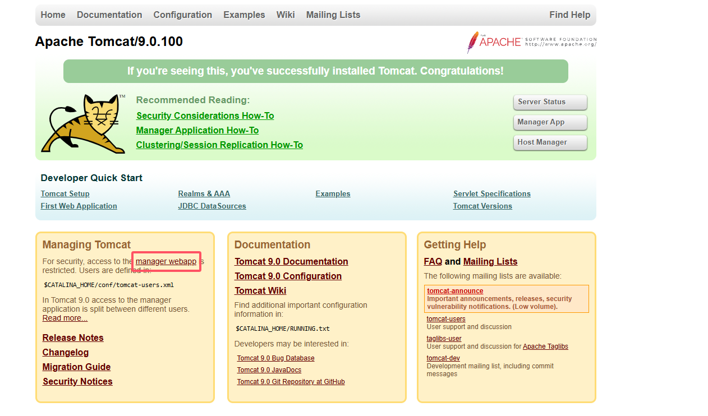
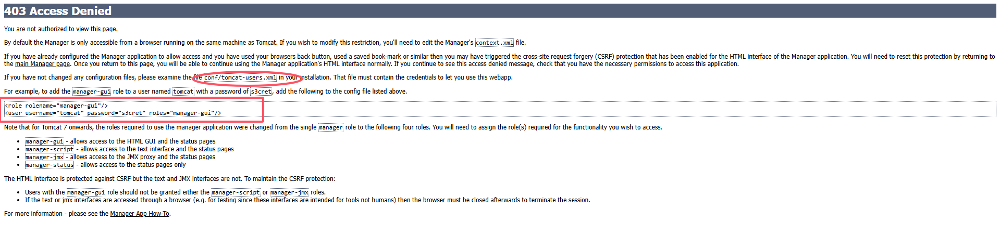
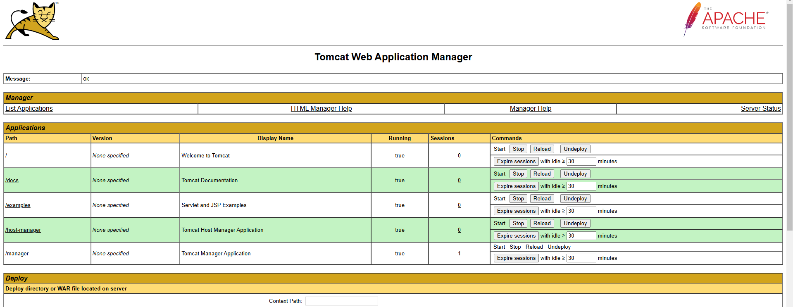

# tomcat

## 1. 安装JDK
```
yum install java-1.8.0-openjdk* -y
```
* 配置环境变量，JAVA_HOME
> /etc/profile
```
export JAVA_HOME=/usr/lib/jvm/java-1.8.0-openjdk
```

## 2. 下载tomcat
https://tomcat.apache.org/download-90.cgi
```
wget https://dlcdn.apache.org/tomcat/tomcat-9/v9.0.100/bin/apache-tomcat-9.0.100.tar.gz
```

## 3. 安装tomcat
```
mkdir /opt/tomcat
tar -zxvf apache-tomcat-9.0.100.tar.gz
mv /tmp/apache-tomcat-9.0.100/* /opt/tomcat
```

## 4. 启动tomcat
```
[root@tomcat tmp]# /opt/tomcat/bin/startup.sh
Using CATALINA_BASE:   /opt/tomcat
Using CATALINA_HOME:   /opt/tomcat
Using CATALINA_TMPDIR: /opt/tomcat/temp
Using JRE_HOME:        /usr
Using CLASSPATH:       /opt/tomcat/bin/bootstrap.jar:/opt/tomcat/bin/tomcat-juli.jar
Using CATALINA_OPTS:   
Tomcat started.
```


## 5. 访问tomcat
* 此处关闭防火墙
* 访问地址，http://192.168.50.120:8080/
* 点击`manager webapp`时会权限问题




## 6. 配置tomcat
* 添加用户和角色，/opt/tomcat/conf/tomcat-users.xml
  * 用户和密码都是tomcat
```
<tomcat-users>
  <role rolename="tomcat"/>
  <role rolename="role1"/>
  <role rolename="manager-script"/>
  <role rolename="manager-gui"/>
  <role rolename="manager-status"/>
  <role rolename="admin-gui"/>
  <role rolename="admin-script"/>
  <user username="tomcat" password="tomcat" roles="manager-gui,manager-script,tomcat,admin-gui,admin-script"/>
</tomcat-users>
```
* 允许远程登录,/opt/tomcat/webapps/manager/META-INF/context.xml
  * webapps目录是用来存放所有的项目，而manager是其中的一个项目
```
<!--
  <Valve className="org.apache.catalina.valves.RemoteAddrValve"
         allow="127\.\d+\.\d+\.\d+|::1|0:0:0:0:0:0:0:1" />
-->
```
* 重启tomcat
```
[root@tomcat META-INF]# /opt/tomcat/bin/shutdown.sh 
Using CATALINA_BASE:   /opt/tomcat
Using CATALINA_HOME:   /opt/tomcat
Using CATALINA_TMPDIR: /opt/tomcat/temp
Using JRE_HOME:        /usr
Using CLASSPATH:       /opt/tomcat/bin/bootstrap.jar:/opt/tomcat/bin/tomcat-juli.jar
Using CATALINA_OPTS:   
[root@tomcat META-INF]# 
[root@tomcat META-INF]# /opt/tomcat/bin/startup.sh 
Using CATALINA_BASE:   /opt/tomcat
Using CATALINA_HOME:   /opt/tomcat
Using CATALINA_TMPDIR: /opt/tomcat/temp
Using JRE_HOME:        /usr
Using CLASSPATH:       /opt/tomcat/bin/bootstrap.jar:/opt/tomcat/bin/tomcat-juli.jar
Using CATALINA_OPTS:   
Tomcat started.
```

* 之后即可正常访问

