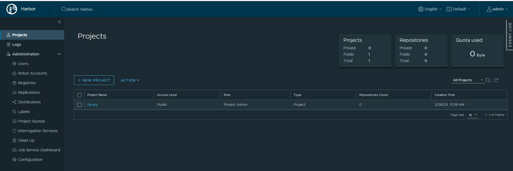

# 安装harbor

Harbor安装

Harbor安装在192.168.66.120上面

## 1. 安装Docker并启动Docker
```
# 安装必要的依赖包
yum install -y yum-utils device-mapper-persistent-data lvm2

# 添加 Docker 官方镜像源
yum-config-manager --add-repo https://download.docker.com/linux/centos/docker-ce.repo

# 安装 Docker CE
yum install -y docker-ce docker-ce-cli containerd.io

# 启动 Docker 并设置开机自启
systemctl start docker
systemctl enable docker
```

## 2. 安装docker-compose
```
# 下载 Docker Compose 二进制文件
curl -L "https://github.com/docker/compose/releases/download/1.29.2/docker-compose-$(uname -s)-$(uname -m)" -o /usr/local/bin/docker-compose

# 添加执行权限
chmod +x /usr/local/bin/docker-compose

# 创建软链接
ln -s /usr/local/bin/docker-compose /usr/bin/docker-compose

# 验证安装
docker-compose --version
```

## 3. 下载并配置Harbor
https://github.com/goharbor/harbor/releases

### 3.1 下载Harbor
```
wget https://github.com/goharbor/harbor/releases/download/v2.8.1/harbor-offline-installer-v2.8.1.tgz
wget https://github.com/goharbor/harbor/releases/download/v2.12.2/harbor-offline-installer-v2.12.2.tgz

# 解压安装包
tar xvf harbor-offline-installer-v2.12.2.tgz

# 移动Harbor
mkdir /opt/harbor
mv harbor/* /opt/harbor
cd /opt/harbor
```

### 3.2 配置Harbor
```
cp harbor.yml.tmpl harbor.yml
vi harbor.yml
```
在 harbor.yml 中，可以根据需要修改以下配置：
* hostname：Harbor 的访问地址，可以是 IP 地址或域名。
```
# grep -E ^hostname: harbor.yml
hostname: 192.168.50.120
```
* http：配置 HTTP 访问端口，默认是 80。
* https：如果需要使用 HTTPS，需要配置证书和密钥的路径。如果不使用https，需要将其注释，否则安装过程报错
* harbor_admin_password：Harbor 管理员的初始密码，默认是 Harbor12345


## 4. 安装Harbor
### 4.1 执行安装脚本
```
./install.sh
```

### 4.2 验证安装
```
docker-compose ps
```
通过浏览器访问harbor.yml中配置的IP和端口，用户名和密码是admin/Harbor12345


### 4.3 开机启动
> vi /etc/systemd/system/harbor.service
```
[Unit]
Description=Harbor Registry
After=network.target

[Service]
Type=oneshot
ExecStart=/opt/harbor/install.sh start
ExecStop=/opt/harbor/install.sh stop
ExecReload=/opt/harbor/install.sh restart
RemainAfterExit=yes

[Install]
WantedBy=multi-user.target
```