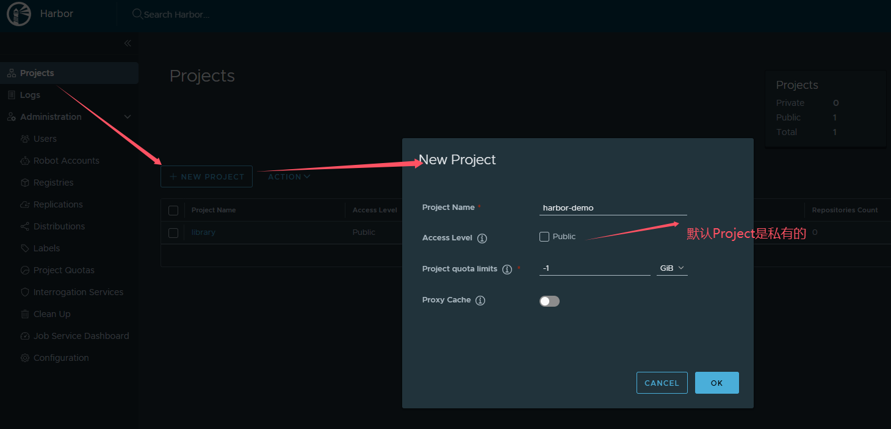
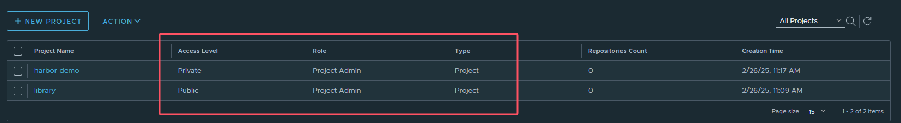
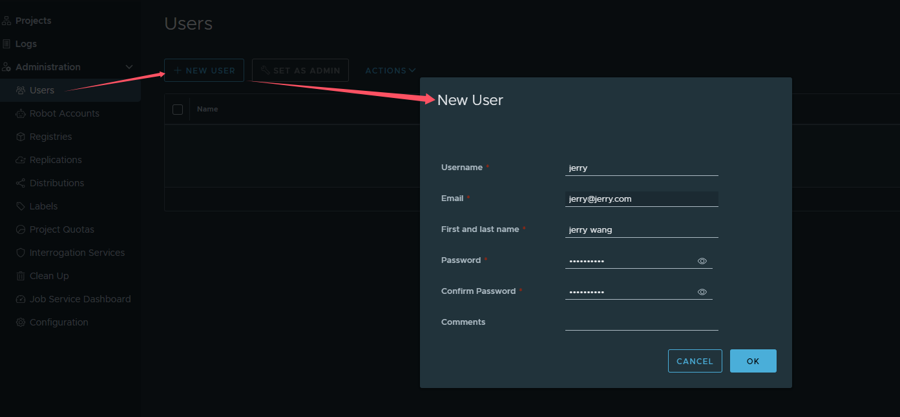
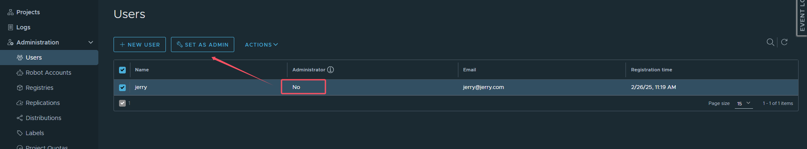
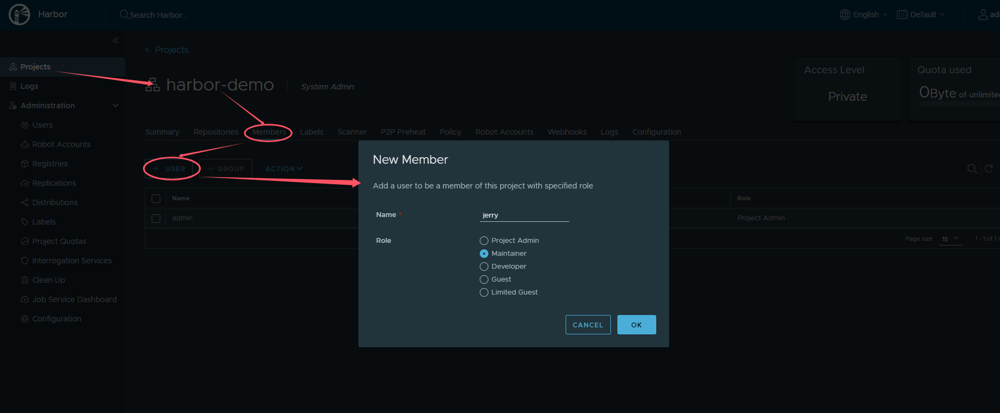
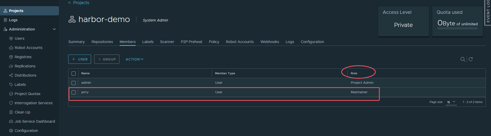
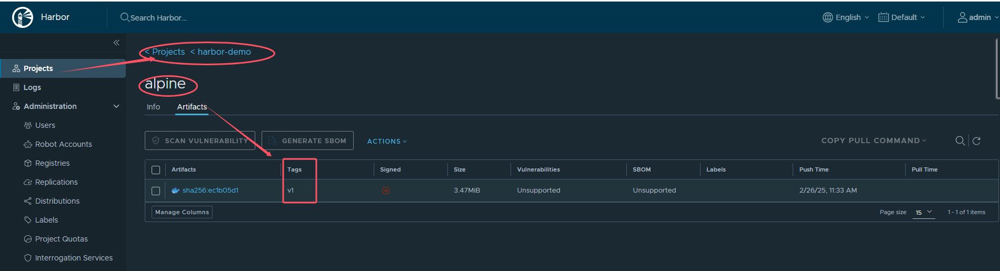

# 从Harbor上传和下载镜像

**不管是上传还是下载镜像，都需要将Harbor地址添加到docker的信任列表，同时登录Harbor**

## 创建Project






## 2. 创建用户
jerry/Jerry12345





## 3. 将用户绑定到创建的Project





## 3. 上传镜像

### 1.1 给镜像打上标签
···
docker tag alpine:latest 192.168.50.120/harbor-demo/alpine:v1
···

### 1.2 把Harbor地址加入到Docker信任列表
> vi /etc/docker/daemon.json
```
{
    "registry-mirrors": ["https://zydio188.mirror.aliyuncs.com"],
    "insecure-registries": ["192.168.66.120"]
}
```
* 需要重启Docker，重新推送即可
* 解决如下问题, docker login强制https的问题
```
# docker login -u jerry http://192.168.50.120
Password: 
Error response from daemon: Get "https://192.168.50.120/v2/": dial tcp 192.168.50.120:443: connect: connection refused
```

### 1.3 登录Harbor
```
docker login -u jerry http://192.168.50.120
```
* 输入密码即可登录


### 1.4 推送镜像
```
docker push 192.168.50.120/harbor-demo/alpine:v1
```




## 4. 下载镜像
```
docker rmi 192.168.50.120/harbor-demo/alpine:v1
docker pull 192.168.50.120/harbor-demo/alpine:v1
```
