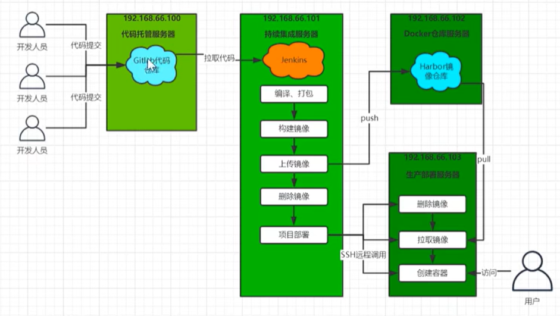

# Arch



## 1. 构建springboot项目，需要导入spring-boot-maven-plugin插件
在pom.xml中添加如下配置:

```xml
<build>
    <plugins>
        <plugin>
            <groupId>org.springframework.boot</groupId>
            <artifactId>spring-boot-maven-plugin</artifactId>
        </plugin>
    </plugins>
</build>
```
* 启动jar包，可以使用`java -jar xxx.jar`

## 2. 构建前端项目
* 本地运行
```
npm run dev
```

* 打包静态web网站
```
npm run build
```
打包后，产生dist目录的静态文件

* 部署到nginx服务器

把dist目录的静态文件拷贝到nginx的html目录，启动nginx

* 启动nginx，并访问
```
http://localhost:8080
```

## 2. 构建docker镜像，需要导入docker-maven-plugin插件
在pom.xml中添加如下配置:

```xml