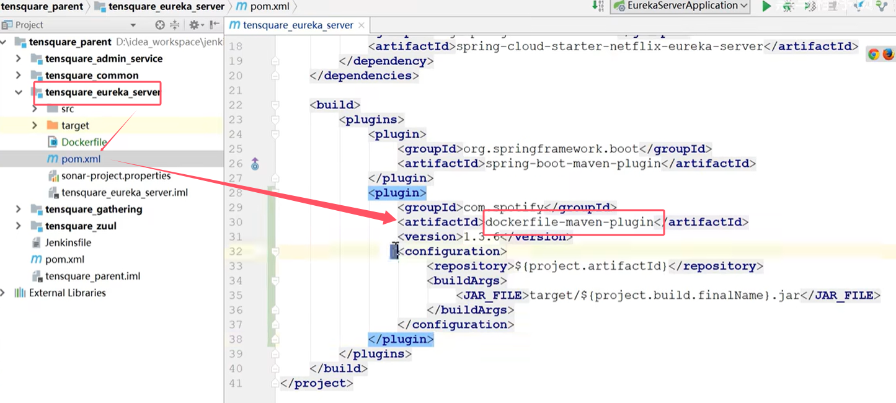
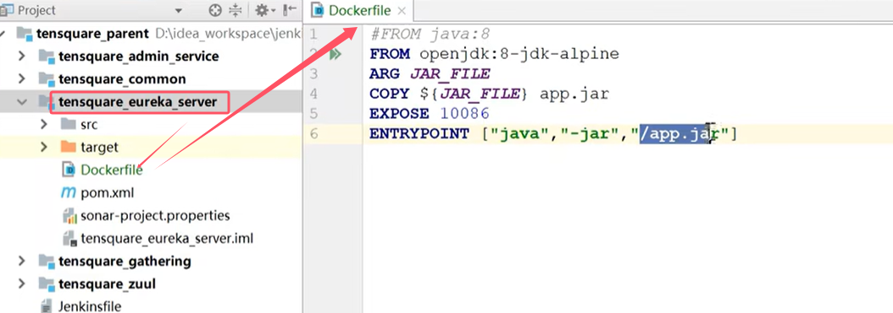
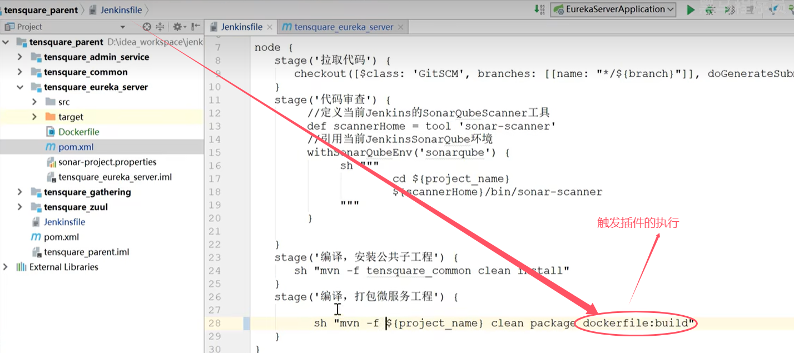

# docker image 

* 在每个微服务项目的pom.xml加入**dockerfile-maven-plugin**插件
```
<plugin>
    <groupId>com.spotify</groupId>
    <artifactId>dockerfile-maven-plugin</artifactId>
    <version>1.3.6</version>
    <configuration>
        <repository>${project.artifactId}</repository>
        <buildArgs>
            <JAR_FILE>target/${project.build.finalName}.jar</JAR_FILE>
        </buildArgs>
    </configuration>
</plugin>
```


* 在每个微服务项目根目录下建立Dockerfile文件
```
#FROM java:8
FROM openjdk:8-jdk-alpine
ARG JAR_FILE
COPY ${JAR_FILE} app.jar
EXPOSE 10086
ENTRYPOINT ["java","-jar","/app.jar"]
```



* 更改Jenkinsfile，触发插件dockerfile-maven-plugin执行
