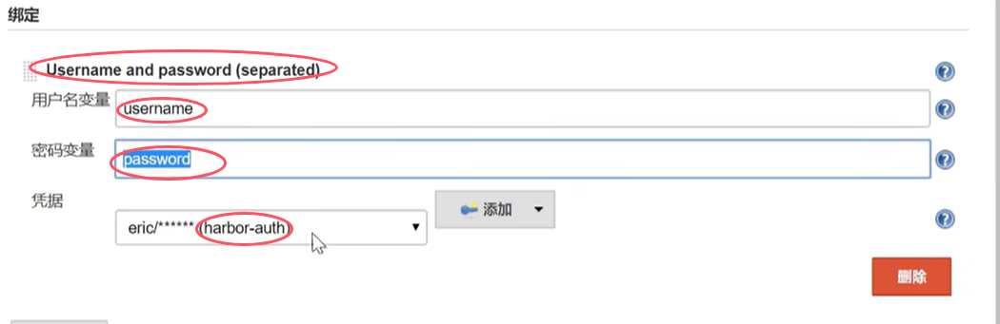
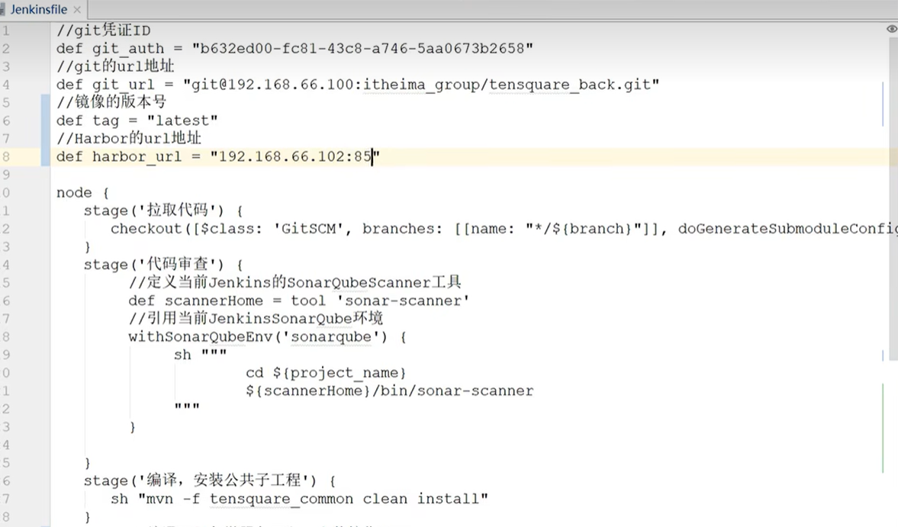
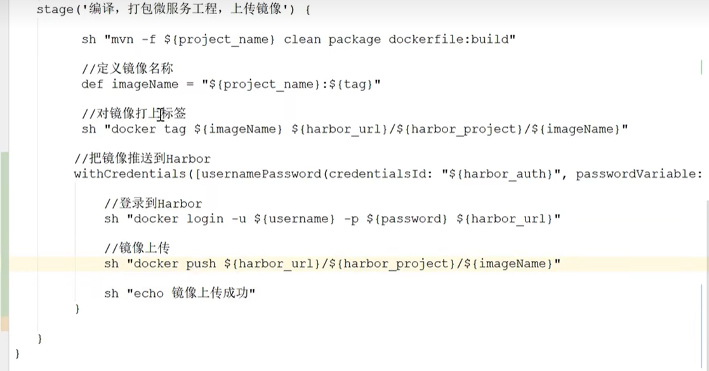

# push image

## 1. 配置harbor
* 首先需要将harbor的账号密码信息配置到Jenkins的Credentials中，然后在Jenkinsfile中引用Credentials的ID即可

* 如何使用Credentials ID呢？可以通过Jenkins的`Pipeline syntax`的片段生成器中的`withCredentials: Bind credentials to variables`

## Jenkinsfile

