# simple microservice demo

## 1. 新建一个项目

新建一个名为simple-microservice-demo的pipeline项目

### 1.1 变量参数化

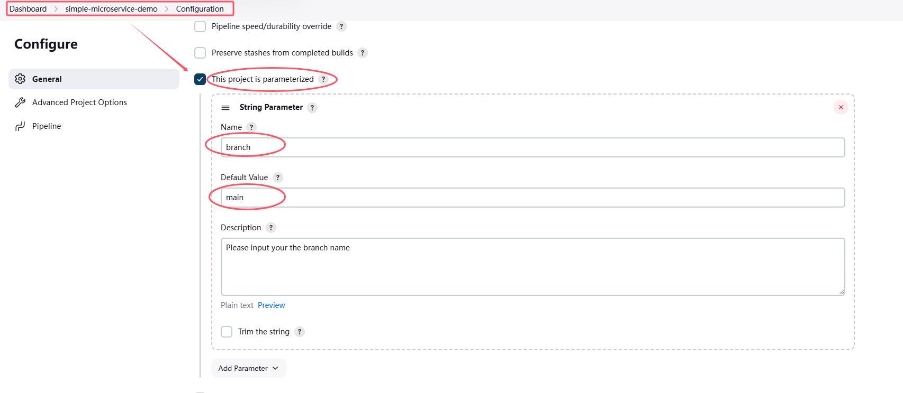

### 1.2 配置触发器模式

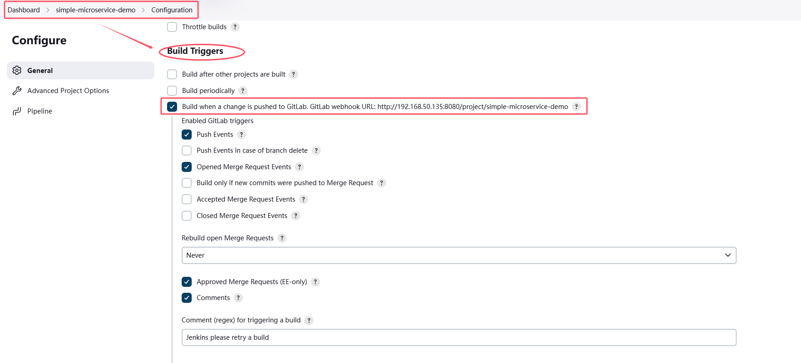

* 点击`Advanced`，生成token，用于配置Gitlab的webhook

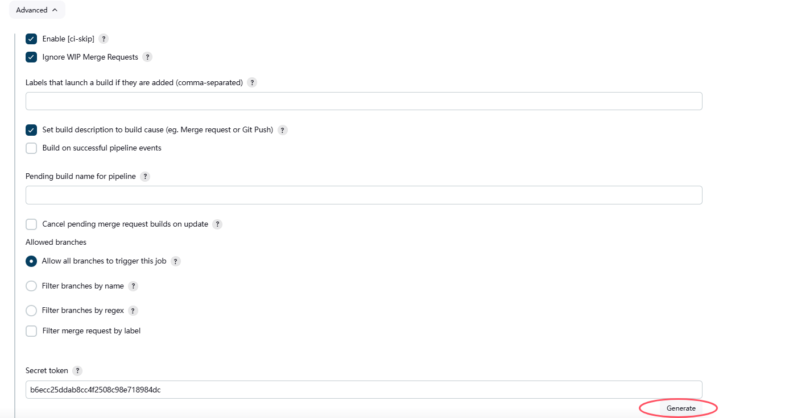

### 1.3 配置pipeline

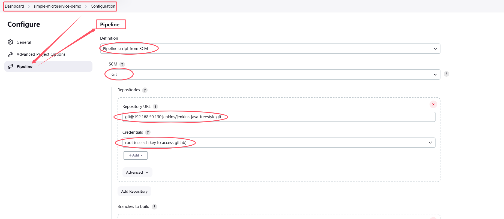

### 1.4 配置Gitlab仓库的webhook

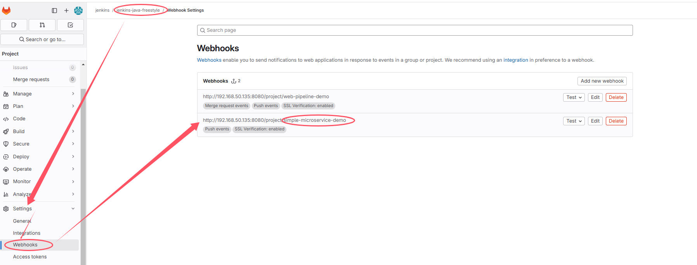

## 2. 配置Jenkinsfile——拉取代码
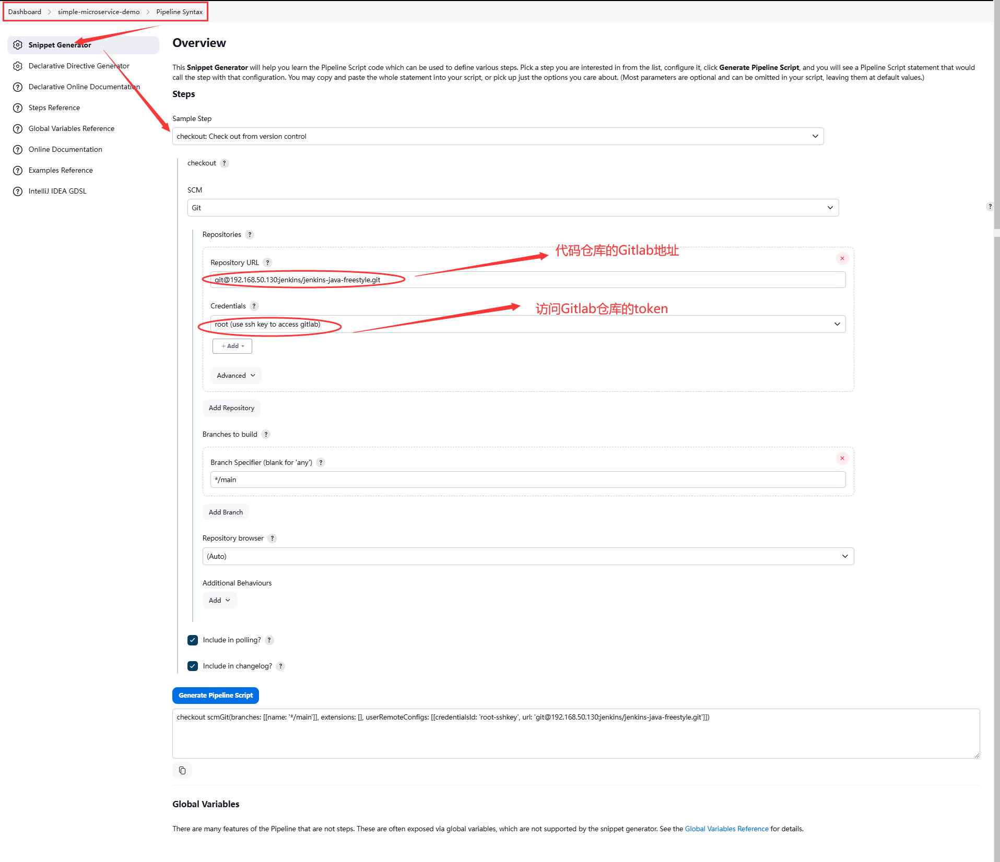

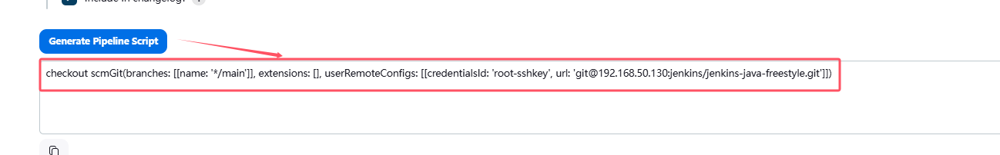

* 配置Gitlab的仓库地址和访问Gitlab仓库的Credentials，最后点击`Generate`即可生成脚本
* 注意将`branch`参数化，这样在触发构建时，可以指定分支
```
pipeline {
    agent any

    stages {
        stage('Checkout code') {
            steps {
                checkout scmGit(branches: [[name: '*/${branch}']], extensions: [], userRemoteConfigs: [[credentialsId: 'root-sshkey', url: 'git@192.168.50.130:jenkins/jenkins-java-freestyle.git']])
            }
        }
    }
}
```

## 3. 配置Jenkinsfile——代码审查
```
pipeline {
    agent any

    stages {
        stage('Checkout code') {
            steps {
                checkout scmGit(branches: [[name: '*/${branch}']], extensions: [], userRemoteConfigs: [[credentialsId: 'root-sshkey', url: 'git@192.168.50.130:jenkins/jenkins-java-freestyle.git']])
            }
        }
        stage('Review code') {
            steps {
                script {
                    // 引入SonarQubeScanner工具
                    scannerHome = tool 'sonarqube-demo'
                }
                // 引入SonarQube的服务器环境
                withSonarQubeEnv('sonarqube-server') {
                    sh "${scannerHome}/bin/sonar-scanner"
                }
            }
        }
    }
}
```

### 4. 配置Jenkinsfile——编译jar包
```
pipeline {
    agent any

    stages {
        stage('Checkout code') {
            steps {
                checkout scmGit(branches: [[name: '*/${branch}']], extensions: [], userRemoteConfigs: [[credentialsId: 'root-sshkey', url: 'git@192.168.50.130:jenkins/jenkins-java-freestyle.git']])
            }
        }
        stage('Review code') {
            steps {
                script {
                    // 引入SonarQubeScanner工具
                    scannerHome = tool 'sonarqube-demo'
                }
                // 引入SonarQube的服务器环境
                withSonarQubeEnv('sonarqube-server') {
                    sh "${scannerHome}/bin/sonar-scanner"
                }
            }
        }
        stage('Build project') {
            steps {
                sh 'mvn clean package'
            }
        }
    }
}
```


## 4. 使用Dockerfile编译生成镜像
### 4.1 Dockerfile
```
FROM docker.1ms.run/openjdk:11
ARG WAR_FILE
COPY ${WAR_FILE} app.war
```

### 4.2 更改pom.xml，添加插件`dockerfile-maven-plugin`
```
<plugin>
    <groupId>com.spotify</groupId>
    <artifactId>dockerfile-maven-plugin</artifactId>
    <version>1.4.13</version>
    <configuration>
        <repository>${project.artifactId}</repository>
        <buildArgs>
            <WAR_FILE>target/${project.build.finalName}.war</WAR_FILE>
        </buildArgs>
    </configuration>
</plugin>
```
* 如果遇到奇怪的问题，可以考虑更新插件版本
* `WAR_FILE`是作为参数传递到Dockerfile中

### 4.3 更新Jenkinsfile
* 更改内容如下，在打包命令后添加`dockerfile:build`
```
        stage('Build project') {
            steps {
                sh 'mvn clean package'
            }
        }
```
=>
```
        stage('Build project') {
            steps {
                sh 'mvn clean package dockerfile:build'
            }
        }
```

* 完整的Jenkinsfile如下
```
pipeline {
    agent any

    stages {
        stage('Checkout code') {
            steps {
                checkout scmGit(branches: [[name: '*/${branch}']], extensions: [], userRemoteConfigs: [[credentialsId: 'root-sshkey', url: 'git@192.168.50.130:jenkins/jenkins-java-freestyle.git']])
            }
        }
        stage('Review code') {
            steps {
                script {
                    // 引入SonarQubeScanner工具
                    scannerHome = tool 'sonarqube-demo'
                }
                // 引入SonarQube的服务器环境
                withSonarQubeEnv('sonarqube-server') {
                    sh "${scannerHome}/bin/sonar-scanner"
                }
            }
        }
        stage('Build project') {
            steps {
                sh 'mvn clean package dockerfile:build'
            }
        }
    }
}
```

### 4.4 可以在Jenkins机器上看到打包的镜像
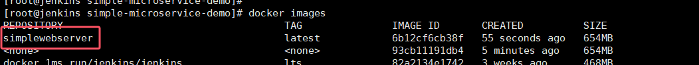


## 5. push镜像到Harbor
### 5.1 配置Harbor的凭证
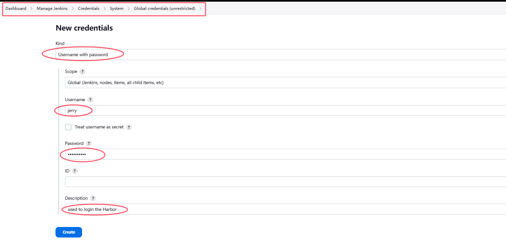

### 5.2 生成使用凭证的脚本
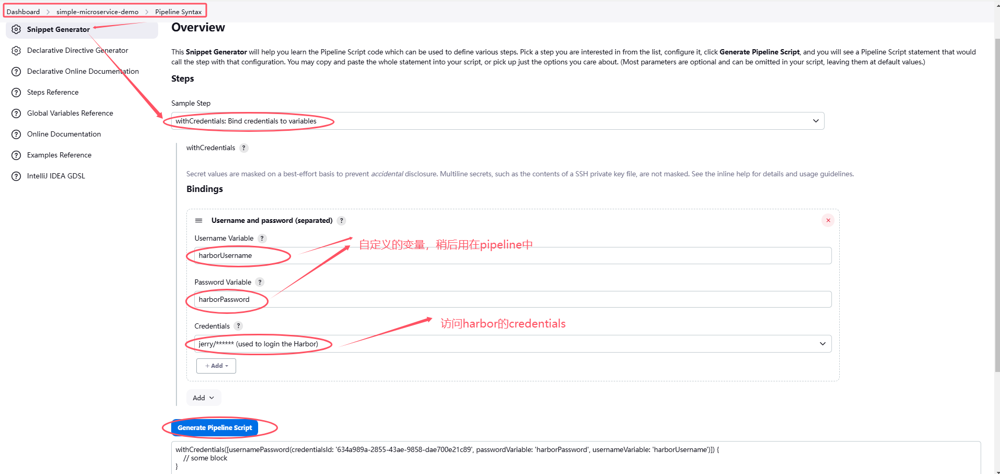

* 拷贝生成的脚本
```
withCredentials([usernamePassword(credentialsId: '634a989a-2855-43ae-9858-dae700e21c89', passwordVariable: 'harborPassword', usernameVariable: 'harborUsername')]) {
    // some block
}
```

### 5.3 配置Jenkinsfile
* 添加push镜像到Harbor的步骤
```
        stage('Push image to Harbor') {
            environment {
                HARBOR_REGISTRY = '192.168.50.120'
                HARBOR_PROJECT = 'harbor-demo'
                project_name = 'simplewebserver'
                tag = 'latest'
                image_name = '${project_name}:${tag}'
            }
            steps {
                withCredentials([usernamePassword(credentialsId: '634a989a-2855-43ae-9858-dae700e21c89', passwordVariable: 'harborPassword', usernameVariable: 'harborUsername')]) {
                    // 登录Harbor
                    sh "docker login -u ${harborUsername} -p ${harborPassword} ${HARBOR_REGISTRY}"
                    // 重新给镜像打tag
                    sh "docker tag ${image_name} ${HARBOR_REGISTRY}/${HARBOR_PROJECT}/${project_name}:${tag}"
                    // 上传镜像
                    sh "docker push ${HARBOR_REGISTRY}/${HARBOR_PROJECT}/${project_name}:${tag}"
                }
            }
        }

```
* 完整的Jenkinsfile如下
```
pipeline {
    agent any

    stages {
        stage('Checkout code') {
            steps {
                checkout scmGit(branches: [[name: '*/${branch}']], extensions: [], userRemoteConfigs: [[credentialsId: 'root-sshkey', url: 'git@192.168.50.130:jenkins/jenkins-java-freestyle.git']])
            }
        }
        stage('Review code') {
            steps {
                script {
                    // 引入SonarQubeScanner工具
                    scannerHome = tool 'sonarqube-demo'
                }
                // 引入SonarQube的服务器环境
                withSonarQubeEnv('sonarqube-server') {
                    sh "${scannerHome}/bin/sonar-scanner"
                }
            }
        }
        stage('Build project') {
            steps {
                sh 'mvn clean package dockerfile:build'
            }
        }
        stage('Push image to Harbor') {
            environment {
                HARBOR_REGISTRY = '192.168.50.120'
                HARBOR_PROJECT = 'harbor-demo'
                project_name = 'simplewebserver'
                tag = 'latest'
                image_name = '${project_name}:${tag}'
            }
            steps {
                withCredentials([usernamePassword(credentialsId: '634a989a-2855-43ae-9858-dae700e21c89', passwordVariable: 'harborPassword', usernameVariable: 'harborUsername')]) {
                    // 登录Harbor
                    sh "docker login -u ${harborUsername} -p ${harborPassword} ${HARBOR_REGISTRY}"
                    // 重新给镜像打tag
                    sh "docker tag ${image_name} ${HARBOR_REGISTRY}/${HARBOR_PROJECT}/${project_name}:${tag}"
                    // 上传镜像
                    sh "docker push ${HARBOR_REGISTRY}/${HARBOR_PROJECT}/${project_name}:${tag}"
                }
            }
        }
    }
    post {
        always {
            emailext(
                subject: '构建通知: ${PROJECT_NAME} - Build # ${BUILD_NUMBER} - ${BUILD_STATUS} !',
                body: '${FILE,path="email.html"}',
                to: '912128114@qq.com'
            )
        }
    }
}
```

### 5.4 验证
* build log

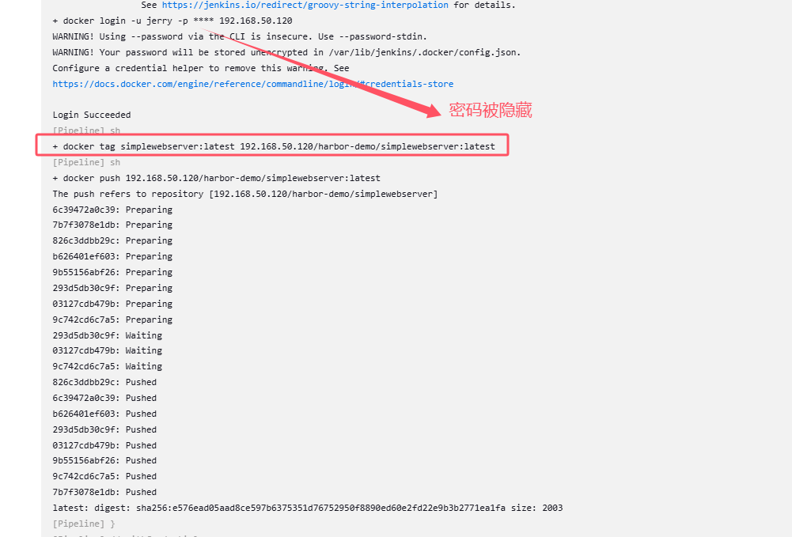

* 镜像上传到Harbor

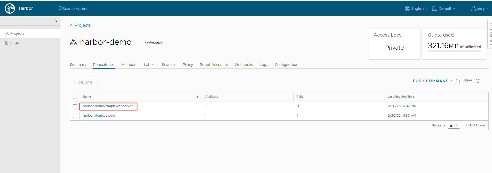


---
## 问题
### 1. [ERROR] Failed to execute goal com.spotify:dockerfile-maven-plugin:1.3.6:build (default-cli) on project SimpleWebServer: Could not build image: java.util.concurrent.ExecutionException: com.spotify.docker.client.shaded.javax.ws.rs.ProcessingException: java.io.IOException: Permission denied -> [Help 1]

=>
将Jenkins用户添加到docker用户组
* 确认docker用户组是否存在
```
cat /etc/group | grep docker
```
* 若存在，则将Jenkins用户添加到docker用户组
```
usermod -aG docker jenkins
id jenkins
```
* 重启Jenkins服务
```
systemctl restart jenkins
```

### 2. [ERROR] Failed to execute goal com.spotify:dockerfile-maven-plugin:1.4.13:build (default-cli) on project SimpleWebServer: Repo name "SimpleWebServer" must contain only lowercase, numbers, '-', '_' or '.'. -> [Help 1]

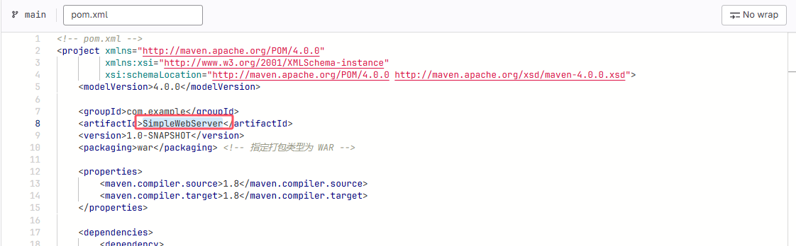

=> 将pom.xml中的artifactId从SimpleWebServer更改为simplewebserver

