# Jenkins的master-slave分布式构建

## 1. 什么事Master-Slave分布式构建

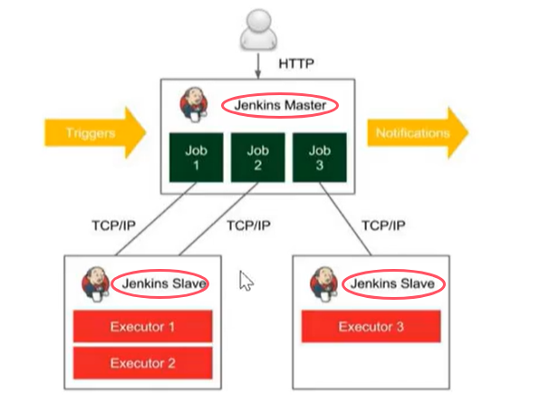

Jenkins的Master-Slave分布式构建，就是将构建任务分发到不同的Slave节点上，由Slave节点执行构建任务，Master节点负责分发任务和收集结果

## 2. 如何实现Master-Slave分布式构建

### 2.1 开启代理程序的TCP端口
> Manage Jenkins -> Security -> Security -> Agents

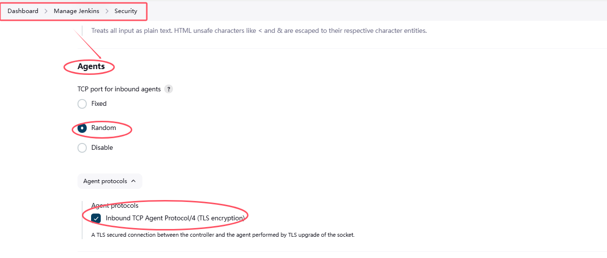


### 2.2 创建节点
> Manage Jenkins -> System Configuration -> Nodes

* 可以看到当前的节点信息，点击`New Node`，可以创建新的Node

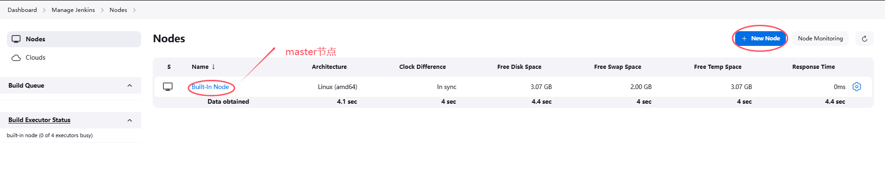

* 创建节点，填写节点名称，选择`Permanent Agent`，点击`Create`；可以指定节点标签，用于指定构建任务在哪个节点上运行(比如按照项目或团队等进行)，也可以不指定

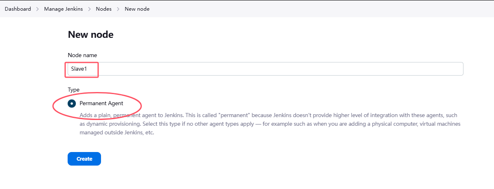

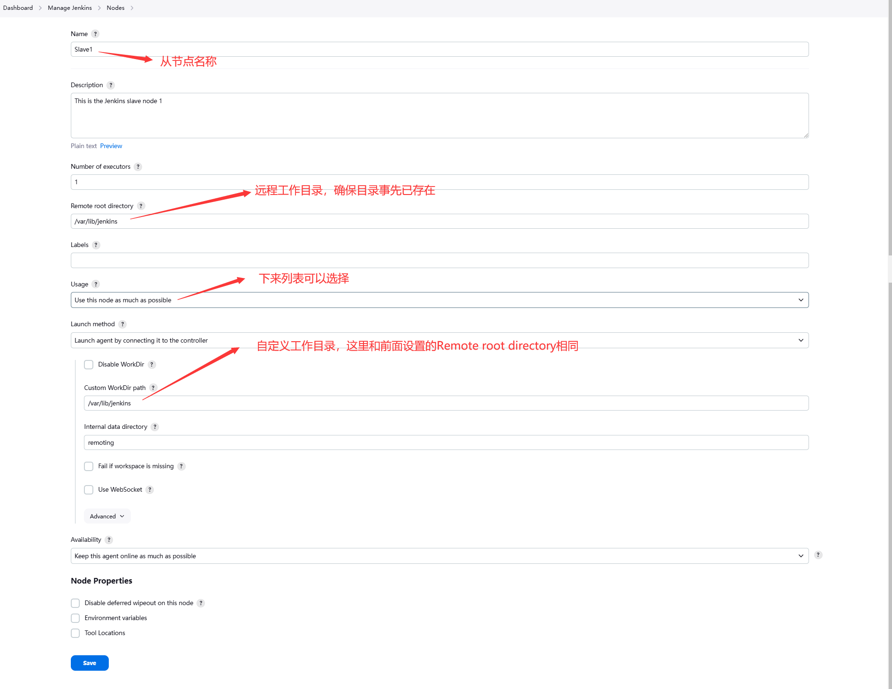

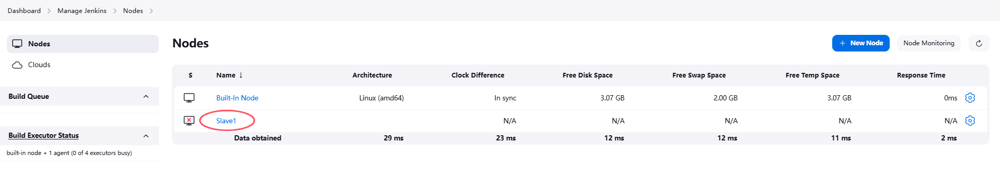

* 点开`Slave1`，可以查看

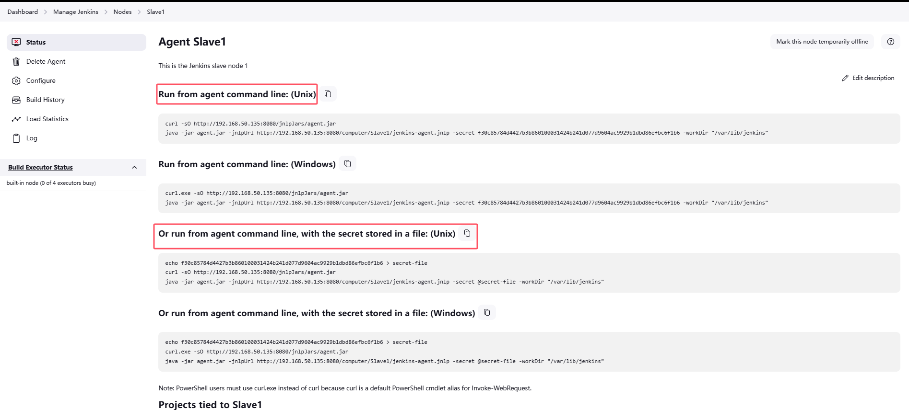

运行如下命令，将Slave1的节点添加到Master中
```
curl -sO http://192.168.50.135:8080/jnlpJars/agent.jar
java -jar agent.jar -jnlpUrl http://192.168.50.135:8080/computer/Slave1/jenkins-agent.jnlp -secret f30c85784d4427b3b860100031424b241d077d9604ac9929b1dbd86efbc6f1b6 -workDir "/var/lib/jenkins"
```
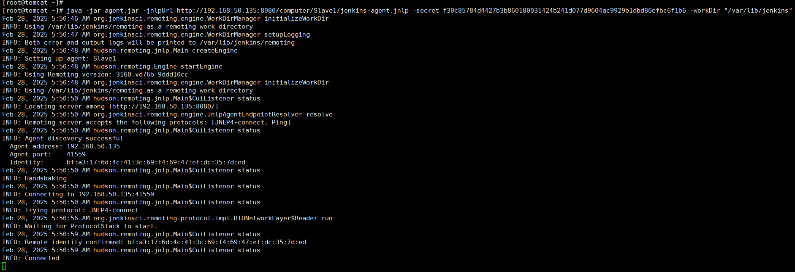

* slave1节点已经添加到Master中，并且状态为`Online`

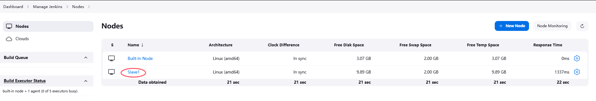

* 在slave节点上安装git
```
yum install -y git
```

* 确保slave节点可以免密访问Gitlab
> 可以像Jenkins server一样，将私有key放到slave节点上

### 2.3 创建Job并分配到Slave节点——freestyle

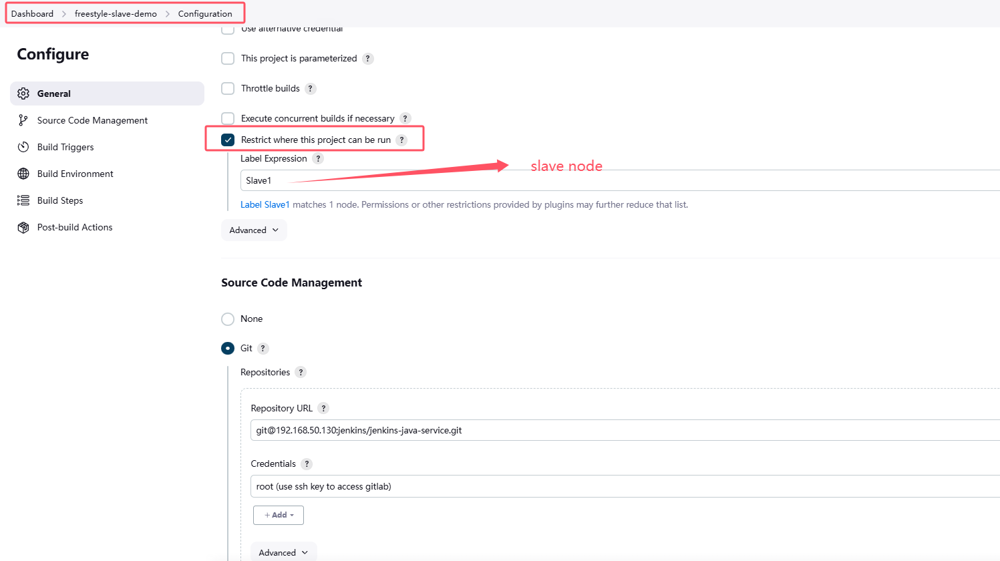

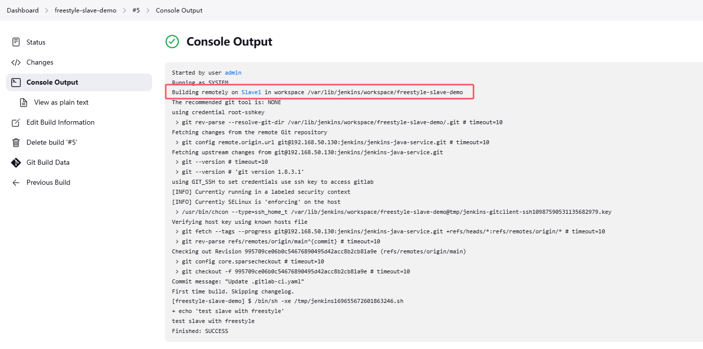


### 2.4 创建Job并分配到Slave节点——Pipeline

#### 2.4.1 通过label指定节点
* 这里给节点加上标签
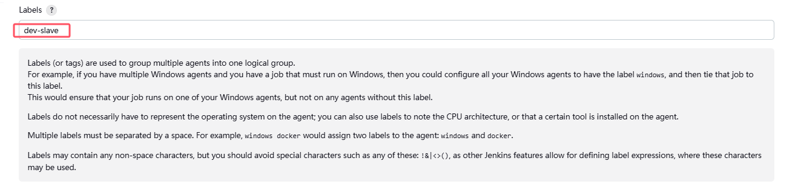


* 在pipeline中通过label选择节点——声明式

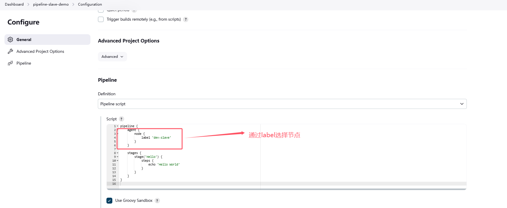

```
pipeline {
    agent {
        node {
            label 'dev-slave'
        }
    }

    stages {
        stage('Hello') {
            steps {
                echo 'Hello World'
            }
        }
    }
}
```

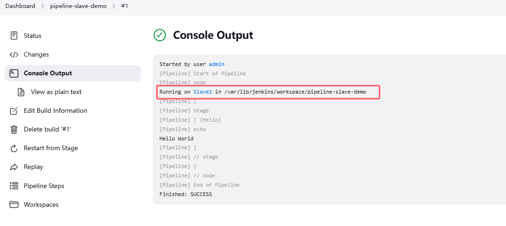

#### 2.4.2 通过name指定节点——脚本式

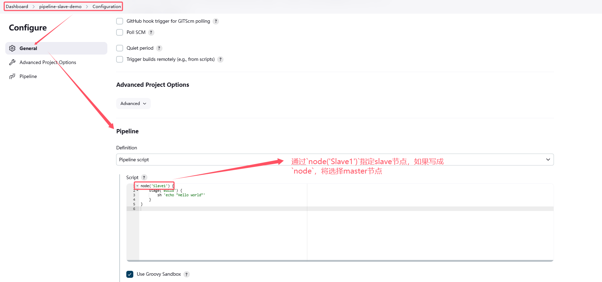
```
node('Slave1') {
    stage('Build') {
        sh 'echo "Hello world"'
    }
}
```

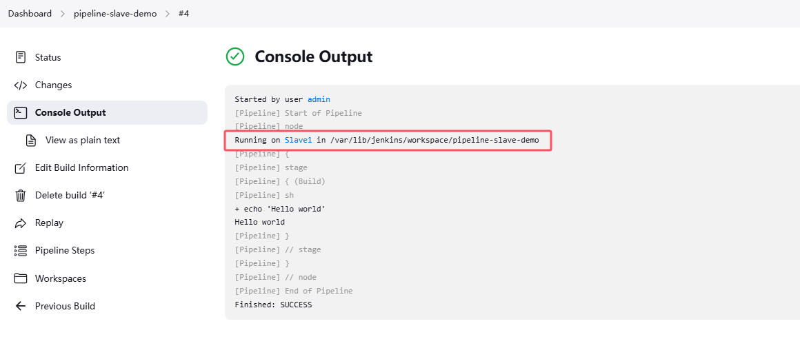