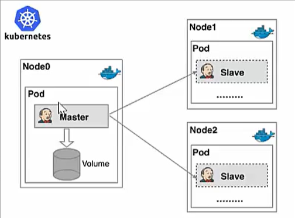
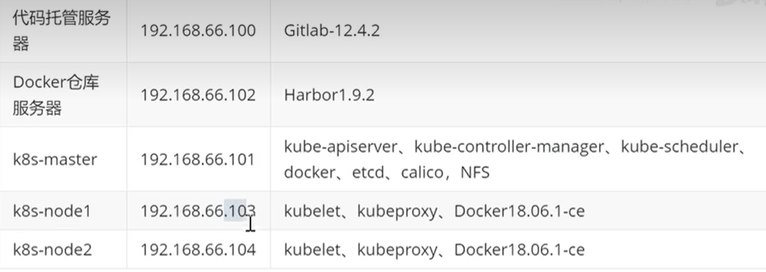
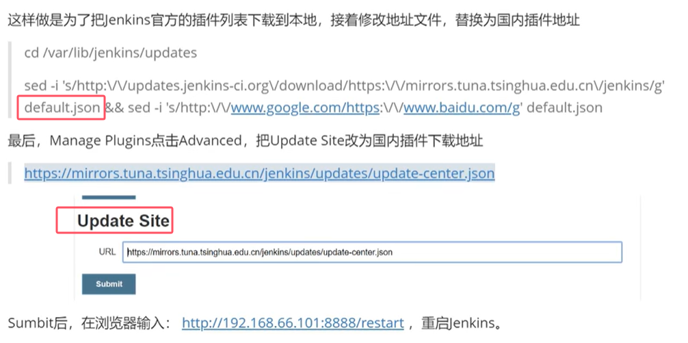
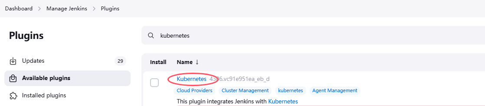

# Kubernetes实现Master-Slave分布式构建方案

## 1. 传统Jenkins的Master-Slave方案的缺陷
* Master节点发生单点故障时，整个流程都不可用了
* 每个Slave节点的配置环境不一样，来完成不同语言的编译打包等操作，但是这些差异化的配置导致管理起来非常不方便，维护起来也是比较费劲
* 资源分配不均衡，有的Slave节点要运行的job出现排队等待，而有的Slave节点处于空闲状态
* 资源浪费，每台Slave节点可能是实体机或者VM，当Slave节点处于空闲状态时，也不会完全释放掉资源


## 2. Kubernetes+Jenkins持续集成架构图



## 3. Kubernetes+Jenkins持续集成方案好处
* **服务高可用**：当Jenkins Master出现故障时，Kubernetes会自动创建一个新的Jenkins Master容器，并且将Volume分配给新创建的容器，保证数据不丢失，从而达到集群服务高可用。
* **动态伸缩，合理使用资源**：每次运行Job时，会自动创建一个Jenkins Slave，Job完成后，Slave自动注销并删除容器，资源自动释放，而且Kubernetes会根据每个资源的使用情况，动态分配Slave到空闲的节点上创建，降低出现因某节点资源利用率高，还排队等待在该节点的情况。
* **扩展性好**：当Kubernetes集群的资源严重不足而导致Job排队等待时，可以很容易的添加一个Kubernetes Node到集群中，从而实现扩展

## 4. 环境搭建



### 4.1 安装NFS
* 安装NFS服务
```
yum install -y nfs-utils
```

* 创建共享目录
```
mkdir -p /opt/nfs/jenkins
vi /etc/exports # 编写NFS的共享配置, 添加如下内容
/opt/nfs/jenkins  *(rw,no_root_squash)  #代表对所有IP都开放此目录，rw是读写
```

* 启动服务
```
systemctl enable nfs  # 开机启动
systemctl start nfs   # 启动
```

* 查看NFS共享目录
```
showmount -e 192.168.66.101 # 192.168.66.101是NFS服务器的IP地址, 可以在其他机器上进行查看
```

### 4.2 更改Jenkins的插件安装地址



## 5. Jenkins与Kubernetes整合

### 5.1 安装Kubernetes插件

