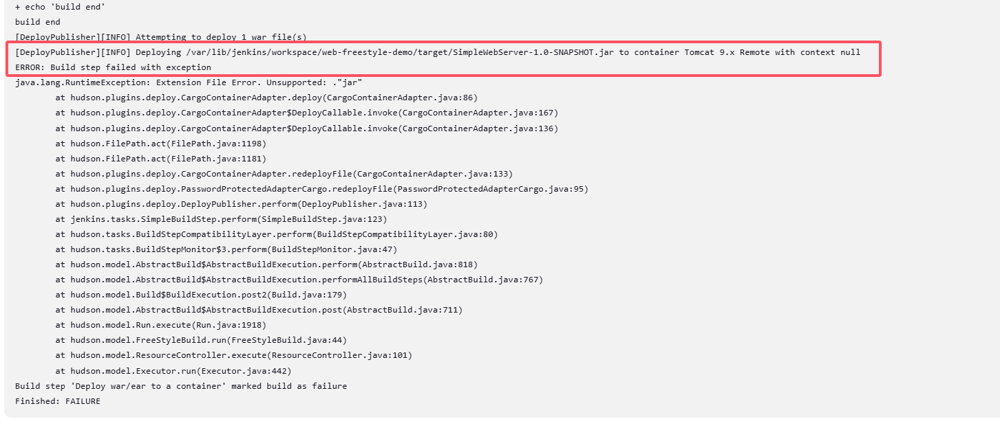

# Jenkins + Maven

## 1. Jenkins构建的项目类型介绍
Jenkins中自动构建项目的类型有很多，常用的有以下三种：
• 自由风格软件项目（FreeStyle Project）
• Maven项目（Maven Project）
• 流水线项目（Pipeline Project）

每种类型的构建其实都可以完成一样的构建过程与结果，只是在操作方式、灵活度等方面有所区别，在实际开发中可以根据自己的需求和习惯来选择。（PS：个人推荐使用流水线类型，因为灵活度非常高）

## 2. 自由风格项目构建
自由风格完成项目的过程：
> 拉取代码->编译->打包->部署

### 2.1 拉取代码
* 新建item


* 配置代码仓库地址


### 2.2 编译打包
```
echo "build start"
mvn clean package
echo "build end"
```


### 2.3 部署
* 安装 `Deploy to container`插件


* 添加tomcat用户凭证


点击`Configure`之后，到页面底部的`Post-build Actions`，点击下拉菜单，可以看到`Deploy war/ear to a container`，如果没有安装`Deploy to container`插件，则不会出现这个选项


点击`Deploy war/ear to a container`进行配置；注意，这里**需要将`target/*.jar`修改为`target/*.war`**


* 重新构建项目


* 验证


---
## 问题
### 1. Deploying *.jar to container Tomcat 9.x Remote with context null


=>

项目打包格式不对，在pom.xml中添加如下配置：


### 2. Error assembling WAR: webxml attribute is required 


=>
需要添加web.xml文件


```
<!-- src/main/webapp/WEB-INF/web.xml -->
<web-app xmlns="http://xmlns.jcp.org/xml/ns/javaee"
         xmlns:xsi="http://www.w3.org/2001/XMLSchema-instance"
         xsi:schemaLocation="http://xmlns.jcp.org/xml/ns/javaee http://xmlns.jcp.org/xml/ns/javaee/web-app_3_1.xsd"
         version="3.1">

    <servlet>
        <servlet-name>IndexServlet</servlet-name>
        <servlet-class>com.example.SimpleWebServer.Main$IndexHandler</servlet-class>
    </servlet>

    <servlet-mapping>
        <servlet-name>IndexServlet</servlet-name>
        <url-pattern>/</url-pattern>
    </servlet-mapping>

</web-app>
```

## 3. Maven项目构建
### 3.1 安装`Maven Integration`插件


### 3.2 Maven项目构建
> 拉取代码->编译->打包->部署

### 3.3 拉取代码
* 新建item


* 配置代码仓库地址


### 3.4 编译打包


### 3.5 部署
利于`Post-build Actions`进行部署的操作，和freestyle一样

