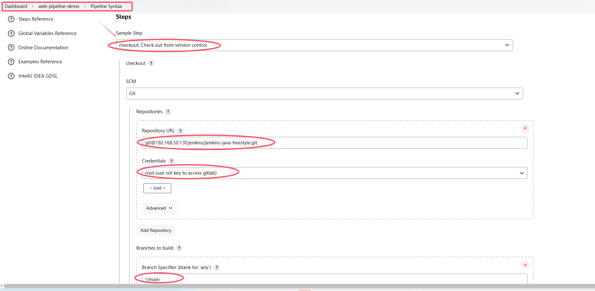
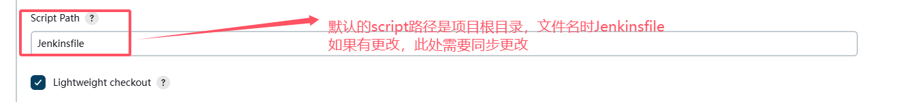

# pipeline

## 1. pipeline简介

1）概念
Pipeline，简单来说，就是一套运行在jenkins上的工作流框架，将原来独立运行于单个或者多个节点的任务连接起来，实现单个任务难以完成的复杂流程编排和可视化的工作。

2）使用Pipeline有以下好处：
代码：Pipeline以代码的形式实现，通常被检入源代码控制，使团队能够编辑，审查和迭代其传送流程。
持久：无论是计划内的还是计划外的服务器重启，Pipeline都是可恢复的。
可停止：Pipeline可接收交互式输入，以确定是否继续执行Pipeline。
多功能：Pipeline支持现实世界中复杂的持续交付要求。它支持fork/join、循环执行，并行执行任务的功能。
可扩展：Pipeline插件支持其DSL的自定义扩展，以及与其他插件集成的多个选项。

3）如何创建 Jenkins Pipeline呢？
* Pipeline脚本是由Groovy语言实现的，但是没必要单独去学习Groovy
* Pipeline支持两种语法：**Declarative(声明式)**和**Scripted Pipeline(脚本式)**语法
* Pipeline也有两种创建方法：可以直接在jenkins的Web UI界面中输入脚本；也可以通过创建一个Jenkinsfile脚本文件放入项目源码库中（一般都推荐在jenkins中直接从源代码控制(SCM)中直接载入Jenkinsfile Pipeline这种方法）


## 2. 安装pipeline

* 需要安装pipeline插件，默认已经安装


* 在新建item时，就可以选择pipeline


* 创建pipeline项目


## 3. pipeline语法
### 3.1 Declarative Pipeline-声明式语法 / 官方推荐
* 基本语法结构


* 简单demo

```
pipeline {
    agent any

    stages {
        stage('Pull code') {
            steps {
                echo 'Pull code'
            }
        }
        stage('Build project') {
            steps {
                echo 'Build project'
            }
        }
    }
}
```
* 构建pipeline项目


### 3.2 Scripted Pipeline-脚本式语法
* 基本语法结构

```
node {
    def mvnHome
    stage('Preparation') { // for display purposes
        // Get some code from a GitHub repository
        git 'https://github.com/jglick/simple-maven-project-with-tests.git'
        // Get the Maven tool.
        // ** NOTE: This 'M3' Maven tool must be configured
        // **       in the global configuration.
        mvnHome = tool 'M3'
    }
    stage('Build') {
        // Run the maven build
        withEnv(["MVN_HOME=$mvnHome"]) {
            if (isUnix()) {
                sh '"$MVN_HOME/bin/mvn" -Dmaven.test.failure.ignore clean package'
            } else {
                bat(/"%MVN_HOME%\bin\mvn" -Dmaven.test.failure.ignore clean package/)
            }
        }
    }
    stage('Results') {
        junit '**/target/surefire-reports/TEST-*.xml'
        archiveArtifacts 'target/*.jar'
    }
}

```

* 简单demo

```
node {
    def mvnHome
    stage('Pull code') {
        echo 'Pull code'
    }
    stage('Build project') {
        echo 'Build project'
    }
}
```
输出和声明式是一样的


## 4. Pipeline项目-实现拉取/构建/部署项目

可以使用Pipeline语法生成一些script


### 4.1 拉取代码
* 通过`Pipeline Syntax`生成脚本，`checkout: Check out from version control`



* 将生成的script拷贝到Pipeline脚本中


```
pipeline {
    agent any

    stages {
        stage('Checkout code') {
            steps {
                checkout scmGit(branches: [[name: '*/main']], extensions: [], userRemoteConfigs: [[credentialsId: 'root-sshkey', url: 'git@192.168.50.130:jenkins/jenkins-java-freestyle.git']])
            }
        }
    }
}
```

* 成功拉取代码


### 4.2 构建项目
* 通过`Pipeline Syntax`生成脚本，选择`sh:Shell Script`


* 将生成的脚本拷贝到项目的Pipeline中


* 成功构建代码


### 4.3 部署项目
* 通过`Pipeline Syntax`生成脚本，选择`deploy: Deploy war/ear to a container`，这里的配置和之前freestyle和maven项目的`Post-build Actions`配置类似


* 将生成的脚本拷贝到项目的Pipeline中


* 成功构建部署


## 5. 将Pipeline脚本进行版本控制-和项目存放在一起
* 在项目根目录下，命名`Jenkinsfile`的文件，将Pipeline脚本拷贝到该文件中


文件内容如下
```
pipeline {
    agent any

    stages {
        stage('Checkout code') {
            steps {
                checkout scmGit(branches: [[name: '*/main']], extensions: [], userRemoteConfigs: [[credentialsId: 'root-sshkey', url: 'git@192.168.50.130:jenkins/jenkins-java-freestyle.git']])
            }
        }
        stage('Build project') {
            steps {
                sh 'mvn clean package'
            }
        }
        stage('Deploy project') {
            steps {
                deploy adapters: [tomcat9(credentialsId: 'tomcat_auth', path: '', url: 'http://192.168.50.120:8080/')], contextPath: null, war: 'target/*.war'
            }
        }
    }
}
```

* 配置项目的Pipeline



* 成功构建部署


