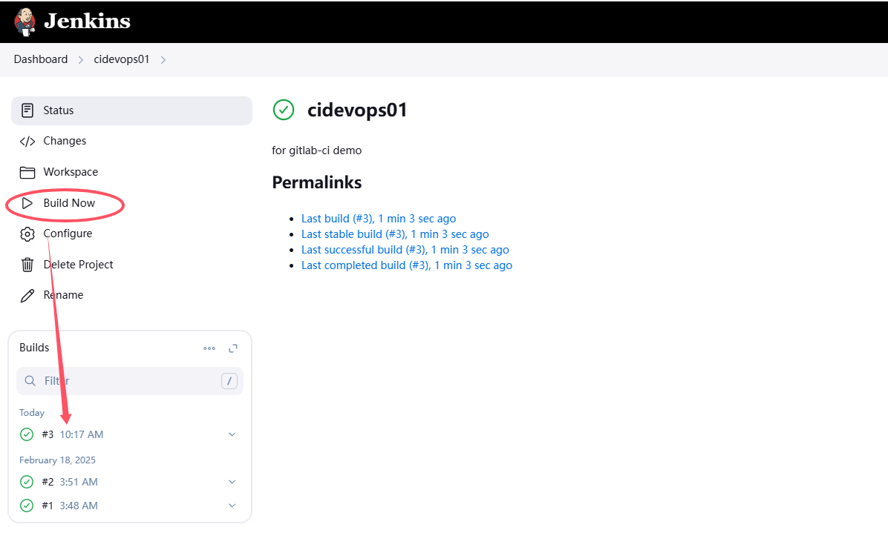

# 凭证管理

凭证可以用来存储需要密文保护的数据库密码、Gitlab密码信息、Docker私有仓库密码等，以便Jenkins可以和这些第三方的应用进行交互。可以利用

https://plugins.jenkins.io/credentials-binding/

## 安装插件
默认这个插件已经安装


## 使用凭证
基本界面


点击`Credentials`，然后点击`System`


点击向下箭头，或者直接点击`Global credentials (unrestricted)`


## 添加凭证

* 经常使用第一、三两种

## 案例一：通过用户名密码从Gitlab上拉代码 
* 安装git插件，让Jenkins可以从git上拉取代码；该插件默认已安装

* 在jenkins机器上安装git
```
yum install -y git
```

### 添加凭证


### 配置item jenkins01


### 验证
* 可以成功build

* 登录到jenkins server上，可以发现代码被拉取到本地
  * 代码存放在`/opt/jenkins/workspace/jenkins01`，即jenkins的`/var/jenkins_home/workspace/jenkins01`


## 案例二：通过SSH免密登录从Gitlab上拉代码
需要实现jenkins所在server可以通过免密方式登录到gitlab server上

### 生成公私钥
```
ssh-keygen -t rsa
```
### 将公钥存放到gitlab server上


### 添加凭证 / 将私钥存放到jenkins server上


### 配置item devops01


### 验证
* 可以成功build

* 登录到jenkins server上，可以发现代码被拉取到本地
  * 代码存放在/opt/jenkins/workspace/cidevops01/var/jenkins_home/workspace/cidevops01


---

* 问题 `No ED25519 host key is known for`

* 解决办法
  * 在jenkins server运行以下命令，获取GitLab的SSH主机密钥, 192.168.50.130为gitlab server的ip
  ```
  # ssh-keyscan 192.168.50.130 >> /root/.ssh/known_hosts
  ```
  * jenkins是运行在容器里，/var/jenkins_home挂载到host的/opt/jenkins目录，在host的/opt/jenkins目录下创建.ssh目录，同时将/root/.ssh/known_hosts复制到/opt/jenkins/.ssh/目录下
  ```
  [root@jenkins jenkins]# pwd
  /opt/jenkins
  [root@jenkins jenkins]# mkdir .ssh
  [root@jenkins jenkins]# cp /root/.ssh/known_hosts .ssh/
  [root@jenkins jenkins]# chown -R 1000.1000 /opt/jenkins/.ssh # 必须操作
  [root@jenkins jenkins]# ll /opt/jenkins/.ssh/
  total 8
  -rw-------. 1 1000 1000 1279 Feb 20 18:05 known_hosts
  ```

* 查看远程仓库的branch或者tag
```
# git ls-remote -h git@192.168.50.130:cidevops/cidevops-java-service.git
fb7fc0c8cd0345ab747b8908b227716b4b5982fd	refs/heads/ci
5e2d729f777a4ab4b9efa6c1989ee3ed9d6f32ed	refs/heads/develop
2c2ddb223d786a0ebd4c6dccd1cb40139c654dbb	refs/heads/devlop
995709ce06b0c54676890495d42acc8b2cb81a9e	refs/heads/main
# git ls-remote -t git@192.168.50.130:cidevops/cidevops-java-service.git
```