# 用户权限管理

可以利用Role-based Authorization Strategy插件管理Jenkins的用户权限，

https://plugins.jenkins.io/role-strategy/

## 安装插件
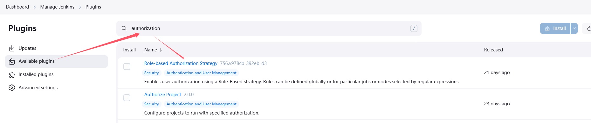

## 开启权限全局安全配置
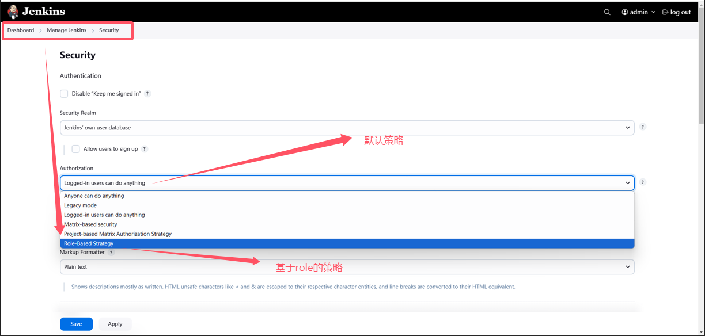

## 创建角色
Jenkins有如下role
* Global roles

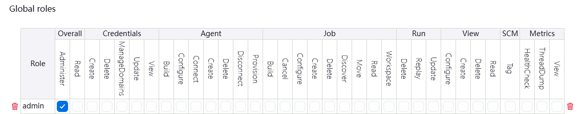

* Item roles

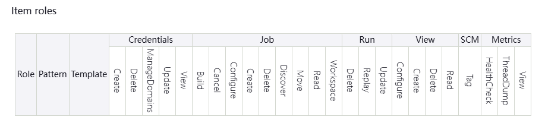

* Agent roles

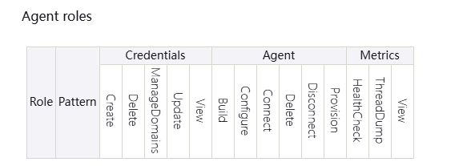

可以看出，Global roles包含了Item roles和Agent roles

### 创建角色
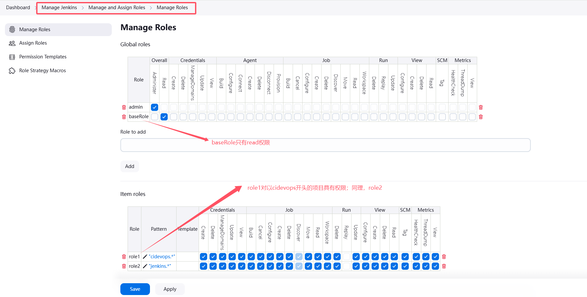

## 创建用户
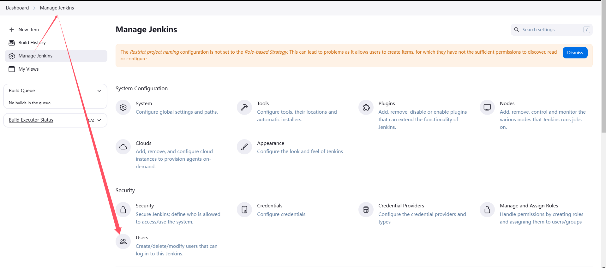

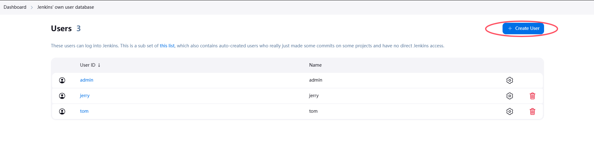

### 创建item
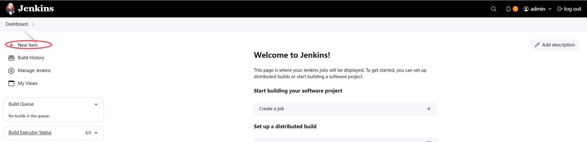

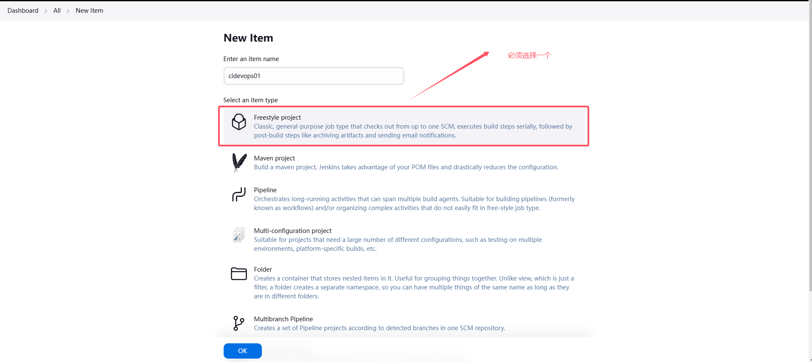

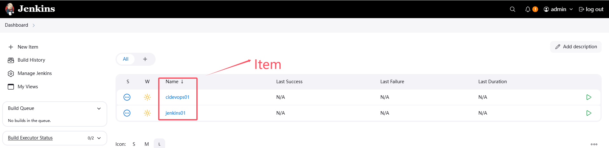

## 分配角色到用户
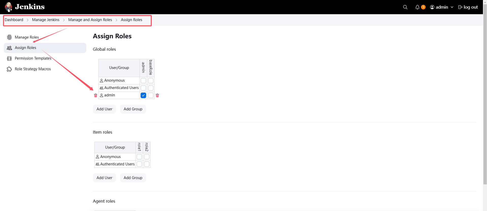

* 用户jerry可以访问item cidevops01(role1) => item roles
* 用户tome可以访问item jenkins01(role2)
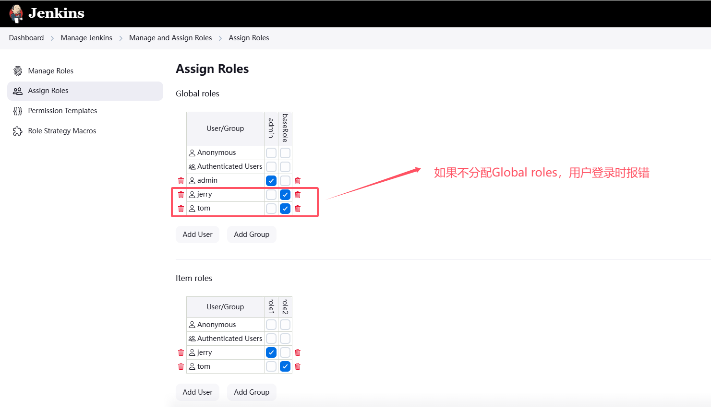
* 如果用户只是赋予role1/role2，仍然无法访问Jenkins，还需要赋予global role；否则，报如下错误
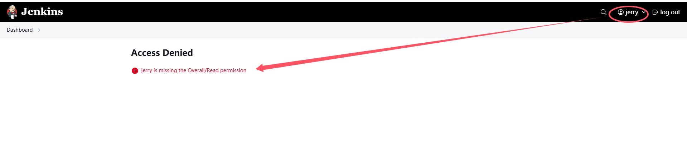
* 用户jerry登录Jenkins只能看到cidevops01(jerry用户被赋予role1，role1的pattern是`cidevops.*`)
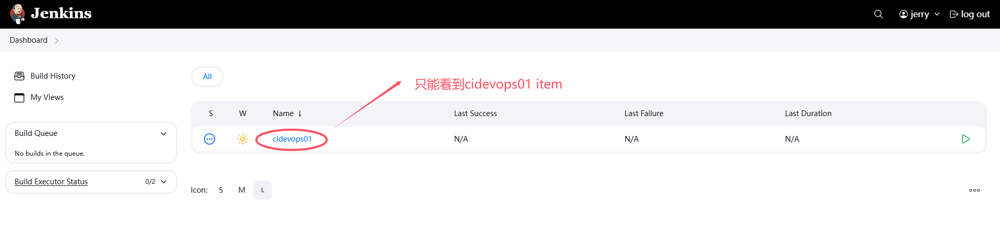

以上即通过role来管理用户对项目的访问权限控制