# trigger

## 1.常用的构建触发器
Jenkins内置4中构建触发器
* 触发远程构建（例如，使用脚本）
* 其他项目构建后触发（build after other projects are build,例如，使用远程调用）
* 定时构建（build periodically）
* 轮询SCM

### 1.1 触发远程构建
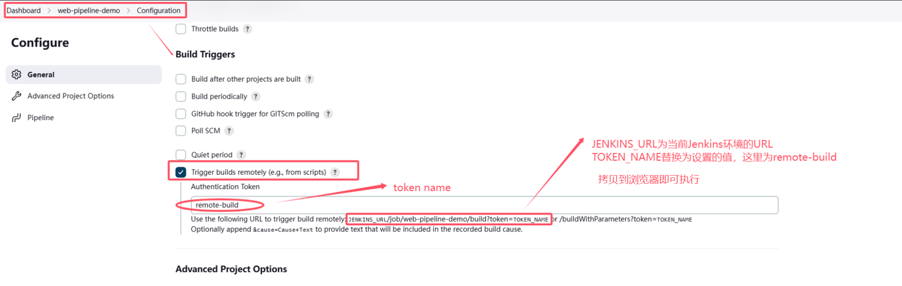

拷贝远程执行地址到浏览器，这里为`http://192.168.50.135:8080/job/web-pipeline-demo/build?token=remote-build`，即可触发构建

### 1.2 其他项目构建后触发
* 前置项目为`pre-trigger-demo`
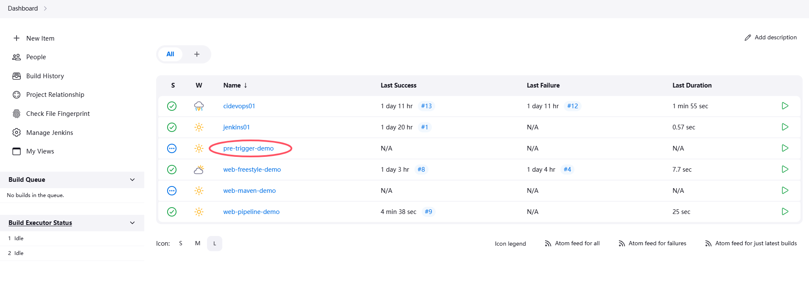

* 配置当前项目的前置触发项目 
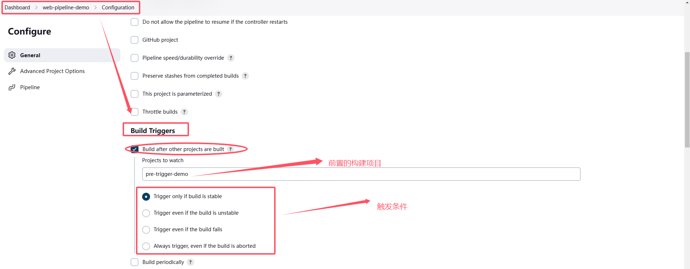

* 前置触发项目构建成功后，当前项目会自动构建

### 1.3 定时构建
* 定时脚本语法
    * H/ H H H H 表示每小时的第H分钟触发构建
    * H/10 * * * * 表示每10分钟触发构建
    * H H H * * * 表示每天的H时H分触发构建
    * H H H * * * 表示每周的H时H分触发构建
* 定时脚本案例
```
每30分钟构建一次：H代表形参
H/30 * * * *    10:02  10:32

每2个小时构建一次：
H H/2 * * *

每天的8点，12点，22点，一天构建3次：（多个时间点中间用逗号隔开）
0 8,12,22 * * *

每天中午12点定时构建一次
H 12 * * *

每天下午18点定时构建一次
H 18 * * *

在每个小时的前半个小时内的每10分钟
H(0-29)/10 * * * *

每两小时一次，每个工作日上午9点到下午5点(也许是上午10:38，下午12:38，下午2:38，下午4:38)
H H(9-16)/2 * * 1-5
```

* 定时构建配置——每2分钟构建一次
> 即使代码没有发生变更，也会触发构建

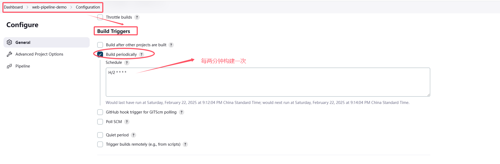

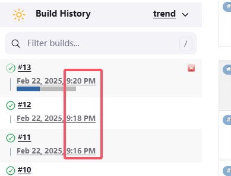

### 1.4 轮询SCM
是指定时扫描本地代码仓库的代码是否有变更，如果有变更则触发构建；**如果扫描发现代码没有发生变更，则不触发构建**
> 轮训SCM触发器，Jenkins会定时扫描本地整个项目的代码，增大系统开销，不建议使用

* 轮询SCM配置——每2分钟扫描一次

  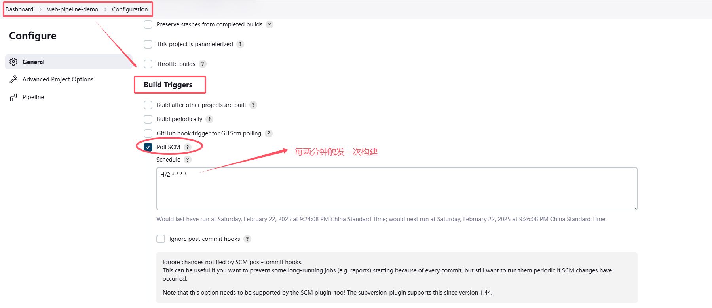

* Jenkinslog可以看到Jenkins触发了构建

  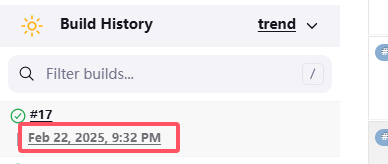

  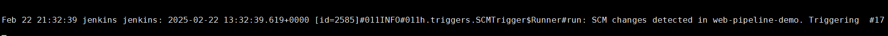

## 2. Git hook自动触发构建

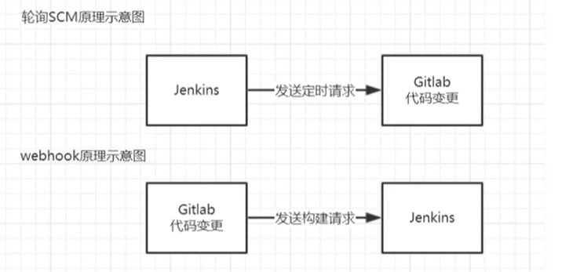

### 2.1 安装GitLab和Gitlab Hook插件
* 如果使用的SCM是svn或者Github，则安装对应的插件

  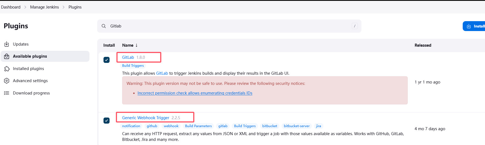

### 2.2 给Jenkins项目设置自动构建

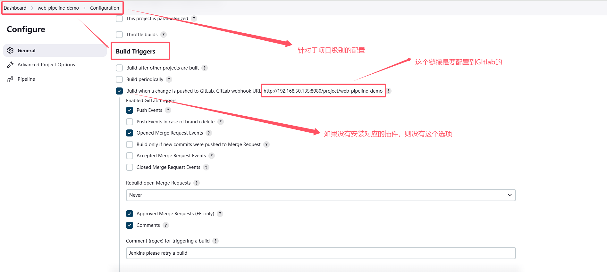

### 2.3 开启GitLab的webhook，允许向Jenkins发送请求

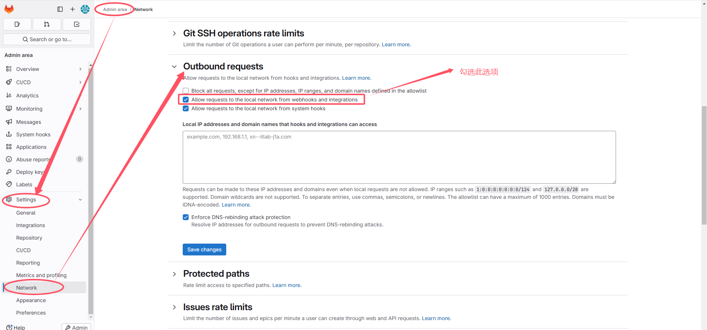

### 2.4 方式一：通过integrations的方式
* 集成Jenkins的配置

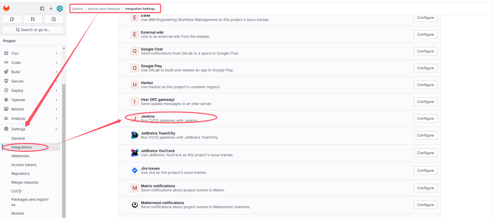

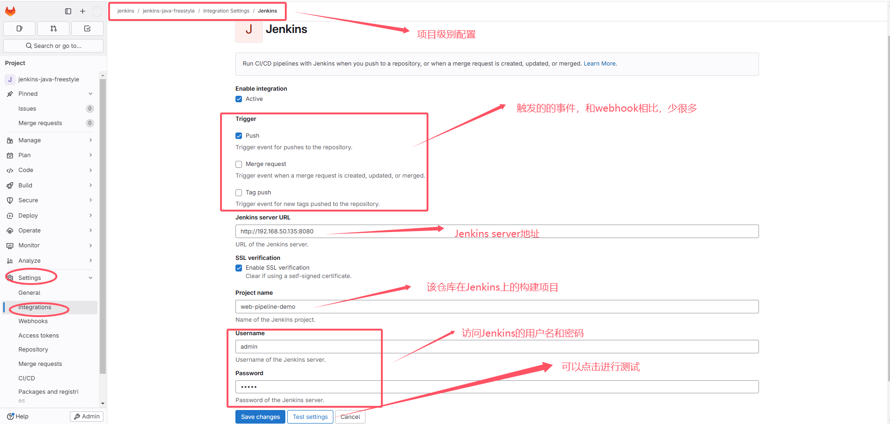

* push代码到GitLab，触发Jenkins自动构建
往该项目push代码，就会触发该项目在Jenkins上的自动构建

### 2.5 方式二：通过Webhooks的方式 - 无token的方式
* 配置Webhooks
  * 将项目在Jenkins上的项目构建URL复制到GitLab对应项目的webhook中, URL就是`2.2 给Jenkins项目设置自动构建`看到的URL，即该项目在Jenkins上的构建URL
  * 这种构建方式可以选择更多的触发条件
  * 在使用webhooks时，Gitlab会推荐你使用`Interations`的方式

  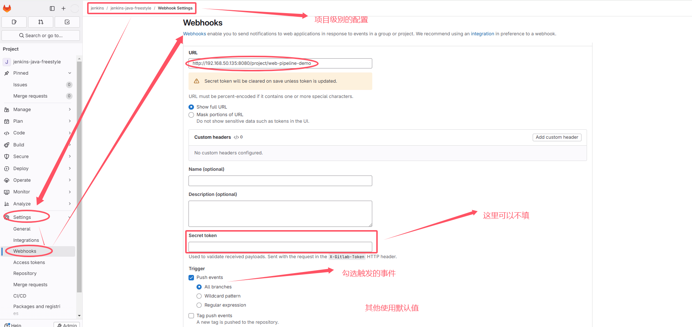

* 添加Webhooks并测试
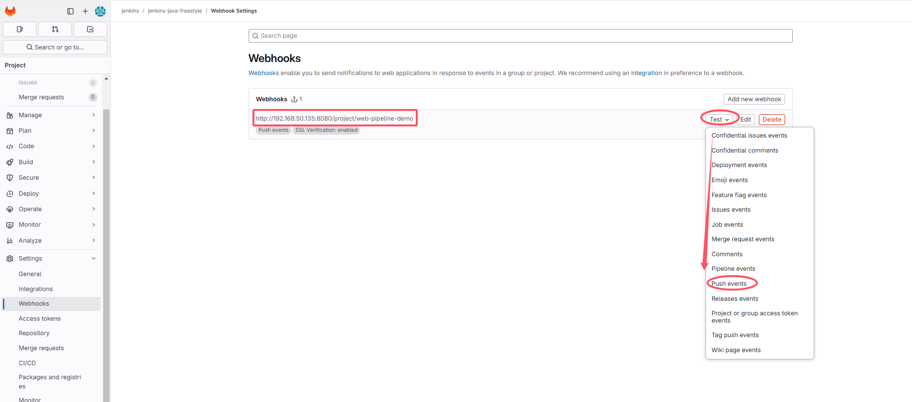

* 当测试时，会报403的问题；这是因为需要配置secret
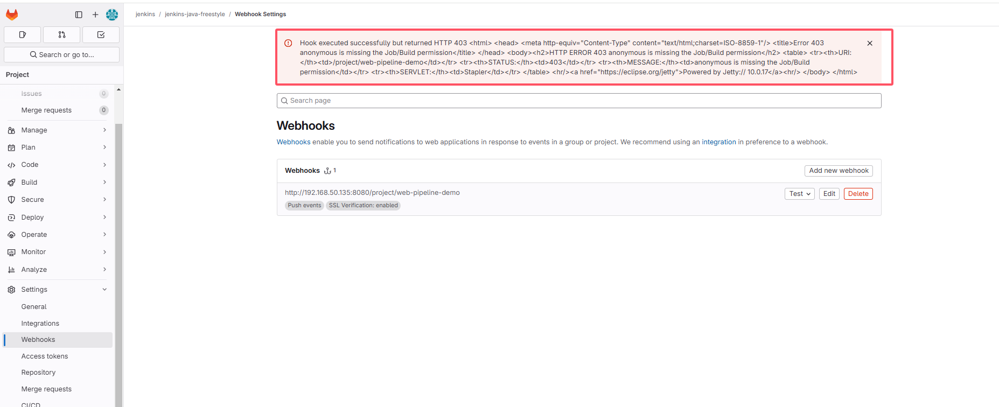

* 临时解决方案，在Jenkins中关闭对http://192.168.50.135:8080/**project**/web-pipeline-demo的认证
  > Manage Jenkins -> System Configuration -> System
  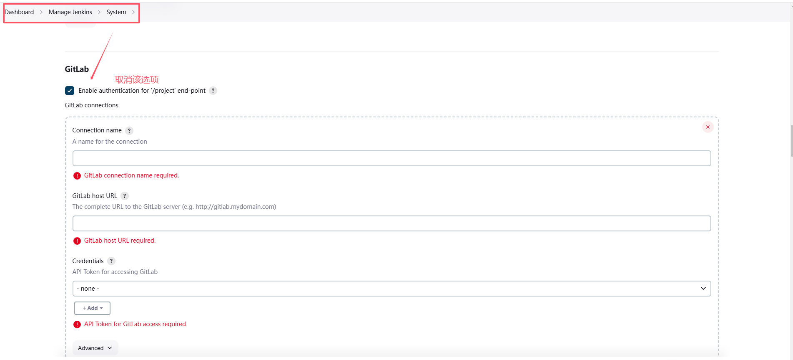

* 重新在Gitlab端进行测试，即可测试成功
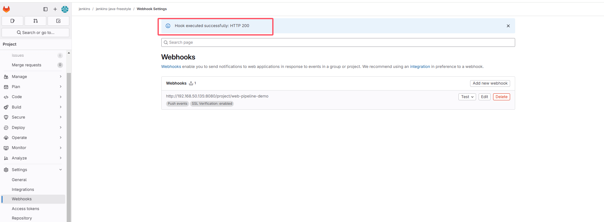

* push代码到GitLab，触发Jenkins自动构建

### 2.6 方式二：通过Webhooks的方式 - 有token的方式(推荐，更安全)
* 配置Webhooks
  * 将项目在Jenkins上的项目构建URL复制到GitLab对应项目的webhook中, URL就是`2.2 给Jenkins项目设置自动构建`看到的URL，即该项目在Jenkins上的构建URL
  * 这种构建方式可以选择更多的触发条件
  * 在使用webhooks时，Gitlab会推荐你使用`Interations`的方式

* 在项目所在的Jenkins中，生成`Secret token`

  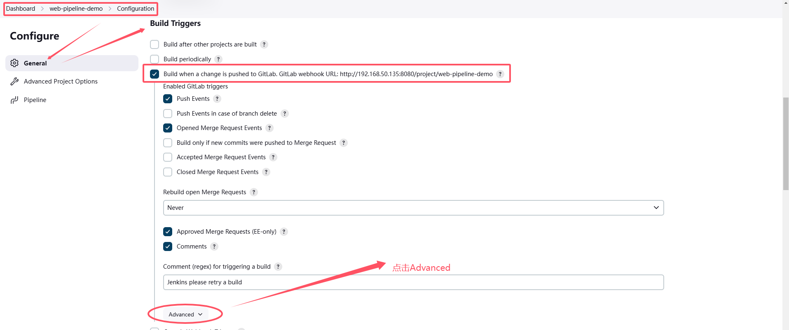

  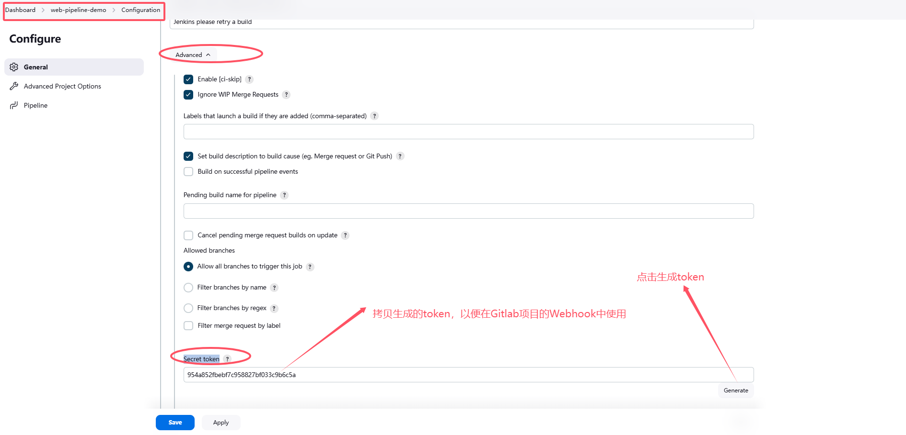

* 将生成的token复制到GitLab对应项目的webhook中

  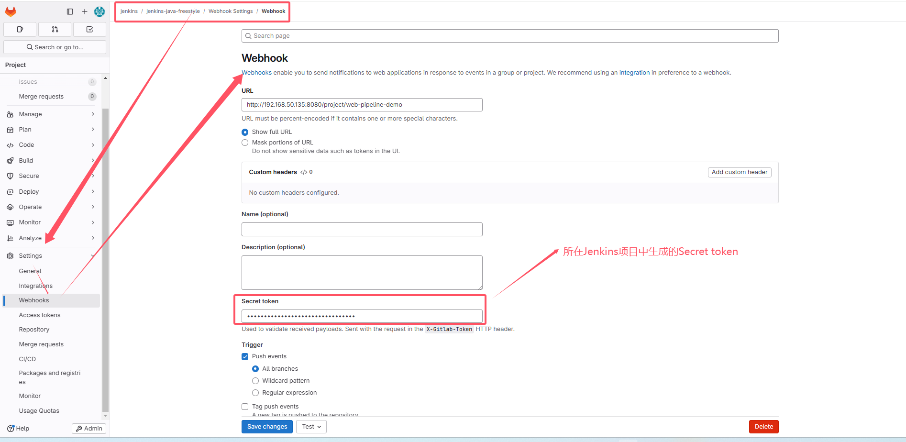

* 测试webhook
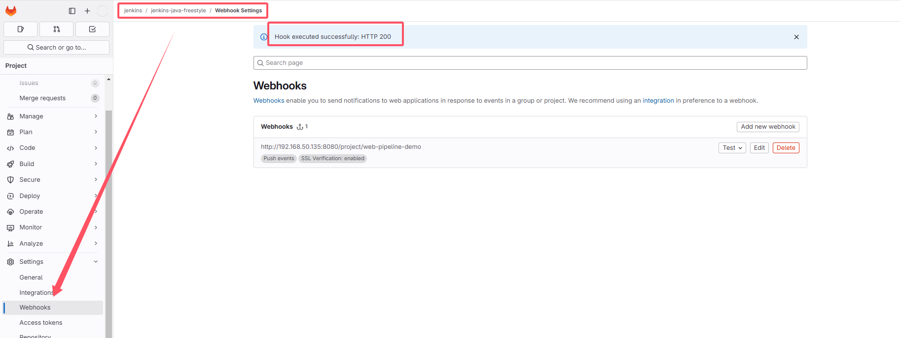

* push代码到GitLab，触发Jenkins自动构建

---
## 问题
### 1. Validation failed: Url is blocked: Requests to the local network are not allowed
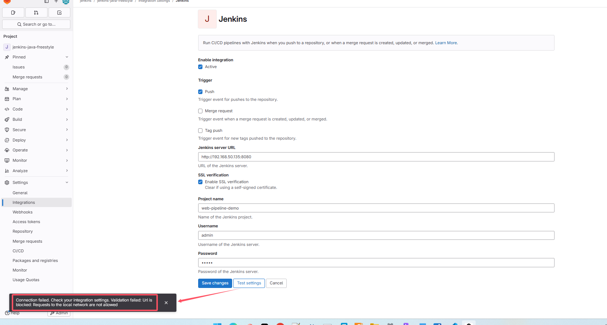
=>
参照上面`开启GitLab的webhook，允许向Jenkins发送请求`步骤进行配置

